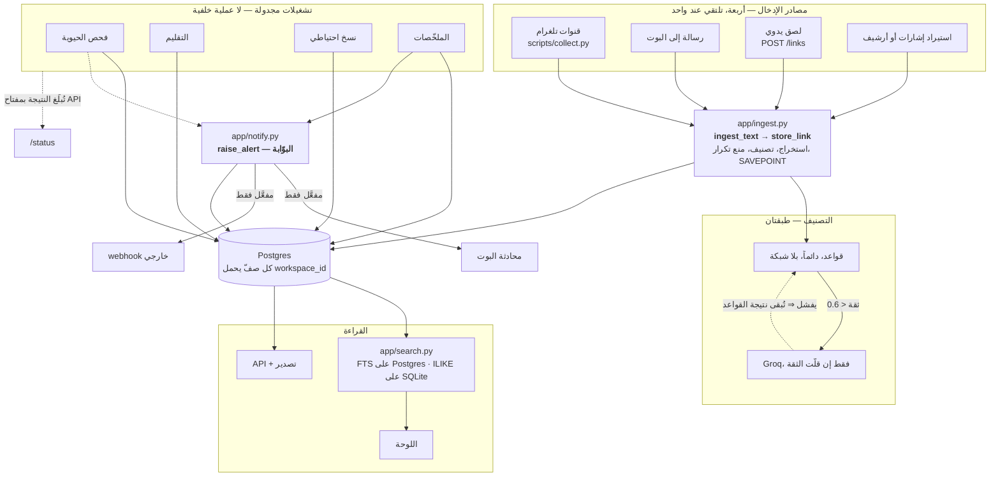

# منصّة استخبارات الروابط (Link Intelligence Platform) — الوثيقة الموحّدة

> **هذه هي الوثيقة الوحيدة للمشروع.** بقرار صريح من مالك المستودع، حلّت
> محلّ **٤٤ ملفّاً منفصلاً** (كل `docs/*.md` + `README.md`) عمداً — كي
> يبقى تعديل التوثيق كلّه في مكان واحد لا يحتاج تنقّلاً بين ملفّات. أيّ
> تحديث مستقبلي على أيّ جانب من المشروع **يُعدَّل هنا**، لا في ملفّ جديد.
> `CONTRIBUTING.md` و`README.md` في جذر المستودع بقيا كملفّين رفيعين
> فقط — GitHub يعرضهما تلقائياً (صفحة المستودع الرئيسية، وشريط "اقرأ
> إرشادات المساهمة" عند فتح PR) — ومحتواهما الفعلي هنا: [§٣٥](#35)
> للمساهمة، وهذه الوثيقة نفسها لكل شيء آخر. `README.en.md` يبقى ملخّصاً
> إنجليزياً منفصلاً ومختصراً كما كان.
>
> **الأرشيف التخطيطي التاريخي** الذي كان قائماً قبل هذا التوحيد
> (تحليل نقدي، خطة تنفيذ من ٣٠٠ فكرة مرقّمة، نتائج مراحل مبكرة) **حُذف
> نهائياً مع البقية** ولا نسخة منه هنا. خلاصته العملية (القرارات
> والمرفوضات وخارطة الطريق) محفوظة في هذه الوثيقة أدناه لأنّها استُخلصت
> منه أصلاً قبل الحذف.
>
> **آخر تحديث للمصادر:** آخر إصدار من الوثائق المتفرّقة قبل التوحيد
> (٣١ أغسطس ٢٠٢٦).

---

## جدول المحتويات

1. [نظرة عامة وجملة القيمة](#1)
2. [القيود الثلاثة الحاكمة](#2)
3. [المعمارية والتكلفة](#3)
4. [البدء السريع](#4)
5. [النشر الفعلي — الدليل الكامل](#5)
6. [طرق إدخال الروابط](#6)
7. [الجمع من تلغرام: البوت، الحسابات، الجمع الفوري](#7)
8. [النسخ الاحتياطي وفحص الحيوية](#8)
9. [الأمان](#9)
10. [إدارة الروابط والحساب](#10)
11. [البحث](#11)
12. [التنبيهات](#12)
13. [الإتاحة](#13)
14. [حالة النظام والمراقبة](#14)
15. [التطوير محلياً وبنية المشروع](#15)
16. [القيود المعروفة — القائمة الكاملة](#16)
17. [قرارات معمارية اتُّخذت فعلاً](#17)
18. [قاموس المصطلحات](#18)
19. [الأسئلة الشائعة](#19)
20. [استكشاف الأخطاء](#20)
21. [دليل المشغّل](#21)
22. [قراءة نتائج CI](#22)
23. [تصميم API](#23)
24. [متغيّرات البيئة](#24)
25. [خارطة الطريق](#25)
26. [سجلّ الأفكار المرفوضة](#26)
27. [المنتج: لمن، ومقابل ماذا](#27)
28. [المخاطر وثمن الفرصة البديلة](#28)
29. [الحوكمة والخصوصية](#29)
30. [كيف تصير الفكرة شيئاً مشحوناً](#30)
31. [كيف نعرف أنّها تنفع](#31)
32. [تسعير محتمل — وثيقة لا قرار](#32)
33. [القياسات التقنية التفصيلية](#33)
34. [ترحيل القاعدة إلى Supabase](#34)
35. [المساهمة بكود](#35)
36. [انضباط السياق عند التطوير بمساعد ذكي](#36)
37. [دفتر التخيّل الحرّ — غير مُلزِم](#38)
38. [الترخيص](#39)

---

<a id="1"></a>
## ١. نظرة عامة وجملة القيمة

**المحور الجوهري:** تحويل الروابط المبعثرة في قنوات تلغرام إلى مجموعة
منظَّمة قابلة للبحث والتصحيح والتصدير — بتكلفة تشغيل **صفر** فعلياً، بدون
Docker، منشورة على Render.

> يجمع الروابط من قنوات تلغرام التي تتابعها، ويصنّفها، ويخبرك أيّها مات —
> في قاعدة بيانات تملكها أنت، بتكلفة صفرية.

جمع الروابط بحدّ ذاته عمل سلعيّ يؤدّيه سكربت من خمسين سطراً؛ القيمة في
الطبقات فوق الجمع: التصنيف، ومنع التكرار، والبحث الذي يجد الرابط بعد
شهور، والقدرة على تصحيح ما أخطأ فيه التصنيف الآلي، ومعرفة أيّ رابط مات.

### مقارنة صادقة بالبدائل

| | Pocket / Raindrop | حفظ يدوي (مفضّلة المتصفّح) | هذه المنصّة |
|---|---|---|---|
| جودة المنتج | ✅ ناضجة، فرق دوام كامل | ✅ لا يتعطّل | ◐ أداة داخلية تعمل |
| تطبيق جوال / إضافة متصفّح | ✅ | ✅ | ❌ ولا في الخطة |
| قارئ مدمج | ✅ | ❌ | ❌ |
| بحث نصّي كامل | ✅ | ❌ | ✅ (Postgres) |
| **جمع تلقائي من قنوات تلغرام** | ❌ | ❌ | ✅ **الفارق الحقيقي** |
| **كشف الروابط الميتة** | ❌ | ❌ | ✅ |
| البيانات في قاعدة تملكها | ❌ | ◐ محلياً | ✅ |
| التكلفة | مجاني محدود/مدفوع | مجاني | صفر |

**الخلاصة الصادقة:** إن لم تكن قنوات تلغرام مصدرك الأساسي، **فـRaindrop
أفضل لك من هذه المنصّة، وليست المسألة قريبة.**

### ما يتّسع له فعلاً — بأرقام مقيسة لا تقديرات (عند سقف الخطة المجانية)

| السؤال | الجواب المقيس |
|---|---|
| كم رابطاً؟ | **~١٫٢ مليون** (١ غيغابايت ÷ ٨٨٦ بايت للرابط شاملة الفهارس) |
| زمن البحث عند هذا السقف | **٣٨–٢٠٢ ملّي ثانية** لمصطلح واقعي (< ١٪ من المجموعة) |
| لوحة الإحصاءات | **٧٫٩ ملّي ثانية** مخبَّأة، ١٫٠٩ ثانية أوّل حساب |
| الذاكرة | **٢٢٧ ميغابايت** من حدّ ٥١٢ |
| صفحة نتائج على الشبكة | **٢٬١٤٤ بايت** مضغوطة (٨٨٪ أقل) |
| ٤٠ تسجيل دخول متزامن | **٣٫٢ ثانية**، و`/healthz` يبقى تحت نصف ثانية |

قِيست على PostgreSQL 16 حقيقي بـ**١٬٢٠٠٬٠٠٠ رابط = ١٫٠٠ غيغابايت بالضبط**،
عبر HTTP الحقيقي ومع RLS مفعَّلاً. التفاصيل الكاملة في [§٣٣](#33).

### ثلاث شخصيات — مُستنتَجة من القرارات لا مقيسة

المشروع **لا يجمع أيّ قياس استخدام** (لا تتبّع، لا تحليلات، لا سجلّ بحث)
— قرار خصوصية مقصود. فمصدر هذه الشخصيات هو ما بُني وما رُفض، لا مقابلات:

- **أ. المتابع الأرشيفي** — يتابع عشرات القنوات، ومشكلته العثور ثانيةً
  بعد أشهر بينما تموت الروابط في الأثناء. الدليل: العلامة المائية
  المتّصلة، سقف ٥٠ رابطاً للرسالة، فحص الحيوية المتباطئ، الأرشفة بدل الحذف.
- **ب. المُشغِّل الذي هو المستخدم نفسه** — ينشر ويصون بنفسه، بلا فريق.
  الدليل: الجدولة بلا عملية دائمة، تنبيه فشل الجامع مفعَّل افتراضياً،
  تأكيد النسخ الاحتياطي يصل عند النجاح أيضاً.
- **ج. المُقيِّم** — لا يستخدم المنتج بل يقرّر هل يستحقّ وقته. الدليل:
  وجود هذه الوثيقة نفسها، وسجلّ المرفوضات، وقسم "ما لن يُبنى"، ورقم
  "الجاهزية ٢/١٠" مكتوباً لا مُصاغاً بعيداً.

**شخصية رُفضت:** "مدير معرفة في شركة" — لا صلاحيات ولا فرق ولا تدقيق
مشترك، فإدراجها كان سيوجّه القرارات نحو مستخدم غير موجود.

### من ليسوا المستخدمين المستهدَفين

| ليس لهم | لماذا |
|---|---|
| من يحفظ من الويب لا من تلغرام | الفارق الوحيد للمنتج لا يعنيهم؛ Raindrop أفضل بلا تردّد |
| من يريد قراءة لاحقة (read-it-later) | هذا أرشيف قابل للبحث، لا صندوق قراءة |
| الفرق | صلاحيات متعدّدة المستخدمين **غير مبنيّة**؛ مساحة العمل اليوم لشخص |
| من يحتاج جوالاً أوّلاً | الواجهة تعمل على الجوال، لكن لا تطبيق ولا نيّة |
| من يحتاج ضماناً تشغيلياً | الخدمة تنام، والقاعدة المجانية محدودة المدّة. **الجاهزية التجارية ٢/١٠** |
| من يحتاج امتثالاً موثَّقاً (SOC2, GDPR DPA) | لا شيء من ذلك ولا يُدّعى |

---

<a id="2"></a>
## ٢. القيود الثلاثة الحاكمة

كل قرار معماري تقريباً في هذا المشروع نتج عن ثلاثة قيود صريحة:

| # | القيد | الأثر |
|---|---|---|
| ١ | **لا Docker، ولا Oracle Cloud، ولا أيّ VPS** | Render بتشغيله الأصلي `runtime: python` — لا `Dockerfile` في المستودع |
| ٢ | **تكلفة صفرية غير مشروطة** | لا مكوّن يتطلّب بطاقة ائتمانية أو خطة مدفوعة أو واجهة مقيسة خارج حصّة مجانية دائمة. المفاتيح الاختيارية (Groq) تُحسِّن ولا تُشغِّل |
| ٣ | **لا توجد خطة عامل خلفي مجانية على Render إطلاقاً** | كل ما يحتاج دورية (الجمع، فحص الحيوية، التقليم، النسخ الاحتياطي) صار تشغيلة مجدولة في GitHub Actions، لا عملية دائمة. البوت webhook لا polling للسبب نفسه |

هذه القيود **غير قابلة للنقاش** إلا بموافقة صريحة من مالك المستودع، وأيّ
اقتراح يخالفها يُرفَض معمارياً بصرف النظر عن جودته (انظر [§٢٦](#26)).

### القيود الثلاثة الأخطر على أرض الواقع

هذه ذُكرت في كل وثيقة تقريباً لأنّها الأهمّ فعلياً — تُذكَر هنا مرّة واحدة كمرجع قاطع، وبقية الوثيقة تُحيل إليها بدل تكرارها:

**أ. نوم الخدمة المجانية.** تتوقّف بعد ~١٥ دقيقة خمول، وأوّل طلب بعدها
يستغرق نحو دقيقة (بما فيه أوّل رسالة تصل للبوت). لا فقدان بيانات — النوم
ليس إعادة تعيين. لا يُصلَح مجاناً: إبقاؤها مستيقظة بطلبات دورية يستهلك
٧٥٠ ساعة الشهر المجانية بلا داعٍ.

**ب. قاعدة بيانات Render المجانية تُحذف بعد ٣٠ يوماً — مؤكَّد لا محتمل.**
كانت مصادر منشورة تتضارب بين ٣٠ و٩٠ يوماً، وتأكَّد الرقم لاحقاً من لقطة
شاشة نشر حقيقي: قاعدة أُنشئت ٢٣ أغسطس ٢٠٢٦ تحمل «Your database will
expire on September 22, 2026. The database will be deleted unless you
upgrade to a paid instance type.» أرشيف يُبنى ليتراكم شهوراً لا يعيش على
هذه القاعدة وحدها. المخفِّف: نسخ احتياطي أسبوعي مشفَّر مستقلّ عن Render
(الفكرة الآن أن يُرحَّل إلى Supabase الدائم — [§٣٤](#34)). الاستعادة
تتطلّب `pg_restore` يدوياً — التفاصيل في [§٢١](#21) §٤.

**ج. كل الجدولة تعتمد على GitHub Actions — نقطة فشل واحدة معترف بها.**
تعطّلها يوقف الجمع والحيوية والتقليم والنسخ الاحتياطي معاً. البديل
الموثَّق: تشغيل السكربتات يدوياً من أيّ جهاز فيه `DATABASE_URL`
([§٢١](#21) §٥).

---

<a id="3"></a>
## ٣. المعمارية والتكلفة

| المكوّن | أين يعمل | التكلفة |
|---|---|---|
| الويب + API + بوت تلغرام (webhook) | خدمة Render واحدة (`free`) | صفر |
| قاعدة البيانات | Render Postgres (`free`) | صفر — لكن انظر القيد (ب) أعلاه |
| الجامع (Telethon) | GitHub Actions، مجدول كل ساعة، **ليس عملية دائمة** | صفر |
| الجمع الفوري (اختياري) | مستمع Telethon داخل خدمة الويب نفسها — لا خدمة ثانية | صفر، لكن فوريّته مرتبطة ببقاء الخدمة مستيقظة (§٧) |
| النسخ الاحتياطي | GitHub Actions، يومي، مشفَّر AES-256، Artifact (٣٠ يوماً) | صفر |
| التصنيف الأساسي | قواعد محلية، بلا اتصال شبكي | صفر دائماً |
| التصنيف الإضافي (اختياري) | Groq API المجاني، فقط إن ضُبط `GROQ_API_KEY` | صفر، ولا يعطّل شيئاً إن غاب |

**الطبقات الثلاث للمنتج:**

| الطبقة | ما تفعله | كيف |
|---|---|---|
| **الإدخال** | أربعة مسارات (خمسة مع API)، ثلاثة منها بلا أيّ مفاتيح | لصق يدوي · استيراد أرشيف/إشارات · جامع Telethon مجدول · مستمع فوري |
| **المعالجة** | استخراج، تصنيف، منع تكرار، تدقيق | منطق موحّد في `app/ingest.py` تستخدمه كل المصادر |
| **الاسترجاع** | بحث، فرز، تصحيح، تصدير، فلترة | Postgres FTS مع ترتيب بالصلة · REST · بوت webhook |

**التصنيف: طبقتان لا أكثر.** قواعد محلية (امتداد/نطاق/كلمات مفتاحية،
بلا استدعاء شبكي، تعالج كل رابط) ← نموذج لغوي اختياري (Groq، يُستدعى فقط
عند ثقة < ٠٫٦، ولا يُعطّل شيئاً إن غاب أو فشل). ثمانية تصنيفات: أفلام
ومسلسلات · برامج وتطبيقات · كتب ودورات · ألعاب · موسيقى · قنوات · للبالغين
· أخرى.

**مبدأ الإدخال الموحَّد:** الطرق الأربع/الخمس **تلتقي عند دالّة واحدة**
(`ingest_text` → `store_link` في `app/ingest.py`)، فلا يتفرّع التصنيف ولا
التخزين حسب المصدر — مبدأ معماري ثابت لا صدفة (انظر رسم التدفّق §١٧).

---

<a id="4"></a>
## ٤. البدء السريع

خمس خطوات، بلا حساب تلغرام وبلا مفتاح Groq وبلا بوت وبلا Docker وبلا
بطاقة دفع.

### ١. انشر الخدمة (٥ دقائق، أغلبها انتظار)

`render.yaml` يتكفّل بكل شيء: افتح <https://dashboard.render.com/blueprints>
← **New Blueprint Instance** ← اختر هذا المستودع ← **Apply**. `SECRET_KEY`
و`BOT_WEBHOOK_SECRET` يُولَّدان تلقائياً؛ البقية يمكن تركها فارغة الآن.

### ٢. اضبط سرّين فقط (دقيقتان)

في لوحة Render ← **Environment**:

| المتغيّر | القيمة | لماذا الآن |
|---|---|---|
| `FIELD_ENCRYPTION_KEY` | ولّدها بالأمر أدناه | الافتراضي **منشور في المستودع**؛ تركه يجعل التشفير زخرفياً |
| `INVITE_CODE` | أيّ نصّ تختاره | بدونه يستطيع أيّ زائر للرابط العامّ إنشاء حساب |

```bash
python -c "from cryptography.fernet import Fernet; print(Fernet.generate_key().decode())"
```

### ٣. أنشئ مساحة عملك (دقيقة)

افتح `https://<اسم-خدمتك>.onrender.com/register`، وأدخل بريدك وكلمة مرور
ورمز الدعوة. **توقّع بطئاً في أوّل طلب** (§٢ب).

### ٤. أضف أوّل رابط (٣٠ ثانية)

من اللوحة، الصق أيّ رابط في صندوق «إضافة روابط». يُصنَّف فوراً بالقواعد؛
جرّبه برابط له امتداد (`.pdf`, `.apk`) لترى التصنيف يقع في مكانه.

### ٥. ابحث فيه (٣٠ ثانية)

على Render (Postgres) البحث نصّي كامل مع ترتيب بالصلة؛ محلياً (SQLite)
يقع إلى `ILIKE` — الفرق مقصود، انظر [§١١](#11).

**ماذا بعد؟** استيراد الإشارات/Pocket، ربط البوت، تفعيل الجامع التلقائي
— كلّها اختيارية والمنصّة تعمل بدونها. انظر [§٦](#6) و[§٧](#7).

---

<a id="5"></a>
## ٥. النشر الفعلي — الدليل الكامل

### ١. نشر الخدمة وقاعدة البيانات

بعد أوّل نشر ناجح، اضبط من لوحة Render (Environment): `INVITE_CODE`،
`PUBLIC_BASE_URL` (رابط Render بعد أوّل نشر)، و`BOT_TOKEN` (اختياري، من
[@BotFather](https://t.me/BotFather)). أعد النشر بعد ضبط `PUBLIC_BASE_URL`
حتى يُسجَّل webhook البوت تلقائياً عند الإقلاع.

### ٢. إنشاء مساحة العمل الأولى

`/register` ← الحساب تلقائياً يصبح مساحة عمل معزولة بالكامل. `workspace_id`
من `/auth/me` — يُحتاج في تفعيل الجامع التلقائي.

### ٣. تفعيل الجامع التلقائي (اختياري)

الجامع مهمّة مجدولة في GitHub Actions كل ساعة، لا عملية دائمة.

1. محلياً على جهازك: `pip install -r requirements-collector.txt` ثم
   `python scripts/make_session_string.py` — يدعم التحقّق بخطوتين.
   > ⚠️ الناتج "session string" **يعادل كلمة مرور حسابك على تلغرام**.
   > شغّله على جهازك أنت فقط، ولا تحفظه في ملف ولا ترسله في أيّ محادثة.
2. أسرار GitHub (Settings → Secrets and variables → Actions):
   `TG_API_ID`, `TG_API_HASH` (من my.telegram.org)، `TG_SESSION_STRING`،
   `DATABASE_URL`، `COLLECTOR_WORKSPACE_ID`، `FIELD_ENCRYPTION_KEY`
   (وُلِّد في §٤)، و`GROQ_API_KEY` (اختياري).
3. شغّل workflow "Collector" يدوياً أوّل مرّة (`workflow_dispatch`).
4. أضف القنوات من `/dashboard` ← "القنوات" — الحساب يجب أن يكون عضواً فيها.

### ٤. تأكّد أن كل شيء موصول (خطوة واحدة، غير اختيارية)

من GitHub: Actions ← "Verify setup" ← Run workflow. أو محلياً:
`python scripts/check_setup.py`. لا يطبع أيّ قيمة سرّية:

```
[ OK ] database: reachable (postgresql)
[ OK ] schema: 6 core tables present
[ OK ] workspace: id 1 ("مساحتي")، 1 user(s)
[WARN] channels: no active channels
[FAIL] telegram: partially configured, missing: TG_SESSION_STRING
[WARN] llm tier: GROQ_API_KEY set but rejected by Groq
```

`FAIL` = يجب إصلاحه، `WARN` = ميزة اختيارية معطّلة والنظام يعمل بدونها.
**البوت لا يردّ؟** لا تخمّن — زر «لماذا لا يردّ البوت؟» في اللوحة، أو
`python scripts/check_bot.py`، يفرّق بين رمز مُبطَل، لا webhook، webhook
على عنوان قديم، وwebhook سليم يفشل تسليمه.

### ٥. النسخ الاحتياطي اليومي المشفَّر

تفصيلها في [§٨](#8).

### ٦. التحقّق التلقائي من حيوية الروابط

تفصيلها في [§٨](#8).

---

<a id="6"></a>
## ٦. طرق إدخال الروابط

المنصّة **تعمل بالكامل** بثلاث طرق **بلا أيّ مفاتيح تلغرام**. الجامع
التلقائي تحسين لاحق لا شرط تشغيل.

| الطريقة | تحتاج مفاتيح تلغرام؟ | متى تستخدمها |
|---|---|---|
| لصق يدوي من اللوحة | ❌ | الأسرع |
| استيراد إشارات المتصفّح/Pocket/Instapaper | ❌ | لنقل مجموعة موجودة |
| استيراد أرشيف Telegram Desktop | ❌ | لسحب تاريخ قناة كامل |
| الجامع التلقائي (كل ساعة) + الجمع الفوري (اختياري) | ✅ | تشغيل مستمرّ |
| `POST /links` بمفتاح API | ✅ (المفتاح) | إدخال برمجي |

```bash
curl -X POST https://<your-app>/links \
  -H "Authorization: Bearer lipk_..." \
  -H "Content-Type: text/plain" \
  --data 'https://example.com/article'
```

### لصق يدوي

اللوحة ← «إضافة روابط يدوياً» ← الصق أيّ نصّ ← «إضافة وتصنيف».

### استيراد إشارات المتصفّح أو Pocket/Instapaper

| المصدر | كيف تُصدّر |
|---|---|
| Chrome/Edge | الإشارات ← مدير الإشارات ← ⋮ ← تصدير |
| Firefox | الإشارات ← إدارة الإشارات ← تصدير إلى HTML |
| Safari | ملف ← تصدير ← الإشارات |
| Pocket | getpocket.com/export |
| Instapaper | الإعدادات ← تصدير ← CSV |

```bash
python scripts/import_bookmarks.py bookmarks.html --workspace 1
python scripts/import_bookmarks.py chrome.html pocket.csv --workspace 1  # عدّة ملفات
```

**الصيغة تُكتشف من المحتوى لا الامتداد**. `--dry-run` يعرض ما سيُستورَد
بلا كتابة. **لا يُستورَد أبداً:** `javascript:`, `chrome://`, `file:` —
تُعدّ وتُبلَّغ صراحةً. كل ملفّ يصير قناة مستقلّة باسمه (لا دمج، حفاظاً على
مصدر كل رابط).

### استيراد أرشيف Telegram Desktop

Telegram Desktop ← افتح القناة ← ⋯ ← **Export chat history** ← أزل علامة
الوسائط ← **Format: JSON** ← Export → `result.json`، ثم:

```bash
python scripts/import_telegram_export.py result.json --workspace 1
```

يستخرج حتى الروابط المخفية خلف نصّ («اضغط [هنا]»).

### تجربة سريعة ببيانات واقعية

```bash
python scripts/seed_demo.py
```

حساب تجريبي و١٦ رابطاً على ٤ قنوات. **قاعدة صارمة:** هذا السكربت **لا
يُشغَّل على قاعدة إنتاج** — يتطلّب `--workspace` صريحاً.

---

<a id="7"></a>
## ٧. الجمع من تلغرام: البوت، الحسابات، الجمع الفوري

### البوت مقابل حساب الجمع — بوت واحد، وحساب أو أكثر

الخلط بينهما أكثر سوء فهم شائع في الإعداد:

| | ما هو | العدد | لماذا |
|---|---|---|---|
| **البوت** | حساب Bot API من BotFather | **واحد** | واجهة بحث واستعلام داخل تلغرام |
| **حساب الجمع** | حسابك الشخصي عبر Telethon (session string) | **واحد أو أكثر** | يقرأ القنوات ويجمع الروابط |

**لماذا لا يكفي البوت للجمع؟** Bot API لا يسمح بقراءة رسائل قناة ليس
مشرفاً فيها، والقنوات ليست ملكك فلا سبيل لجعله مشرفاً. **ولماذا بوت واحد
لا عدّة؟** البوت واجهة استعلام لا عامل؛ كل مساحة عمل تربط محادثتها به عبر
رمز ربط، والعزل في القاعدة على `workspace_id`.

### ربط البوت

1. BotFather ← `/newbot` ← احتفظ بالتوكن (**مفتاح تحكّم كامل** — لا تضعه
   في لقطة شاشة أو محادثة أو المستودع؛ تسرّبه = BotFather ← `/revoke`).
2. Render: `BOT_TOKEN`، `BOT_WEBHOOK_SECRET` (نصّ عشوائي من عندك لا من
   BotFather)، `PUBLIC_BASE_URL`.
3. **لا تسجّل webhook يدوياً** — تُسجَّل عند الإقلاع على
   `PUBLIC_BASE_URL/telegram/webhook/BOT_WEBHOOK_SECRET`. السرّ جزء من
   المسار، فأيّ طلب لا يعرفه يُقابَل بـ٤٠٤.
4. اللوحة ← «البوت» ← «توليد رمز ربط» ← أرسل للبوت `/start <الرمز>`
   (صالح مرّة واحدة).

أوامر البوت: `/search` (يدعم `-كلمة` للاستبعاد)، `/latest`, `/favorite`,
`/details N`, `/stats`, `/vitality`, `/channels`, `/unlink`, `/help`. لصق
رابط مباشر يحفظه؛ كلمة مجرّدة تبحث بها.

### ماذا يُجمَع: كل ما يراه حساب الجمع، لا ما سُجِّل يدوياً فقط

**كان الجمع مقصوراً على ما يُكتَب في اللوحة باليد.** أي أنّ «الجمع من
تلغرام» كان يعني عملياً «الجمع من القنوات التي تذكّرت تسجيلها»، بينما
المجموعات والمحادثات الخاصّة — وهي حيث تمرّ أكثر الروابط في حساب حقيقي —
كانت خارج المتناول بنية التصميم لا بقرار.

الآن **كل تشغيلة تسأل الحساب عن محادثاته وتسجّل ما لا تعرفه**:

| النوع | يُجمَع منه | ملاحظة |
|---|---|---|
| 📢 قناة (broadcast) | ✅ | ما كان مدعوماً أصلاً |
| 👥 مجموعة (supergroup أو مجموعة قديمة) | ✅ | تُصنَّف مجموعةً حتى وإن كانت `Channel` في واجهة تلغرام |
| 💬 محادثة خاصّة (شخص أو بوت) | ✅ | اقرأ تحذير الخصوصية أدناه |

**ثلاث خصائص لكلٍّ منها سببٌ يجعل غيابها عطلاً:**

- **تراكميّ لا تكراريّ.** المحادثة المعروفة تُحدَّث ولا تُكرَّر، والمطابقة
  على الصيغة المعياريّة للمعرّف — فـ`1234567890` المكتوبة يدوياً
  و`-1001234567890` التي يرسلها Telethon **صفٌّ واحد**، لا صفّان
  بعلامتين مائيّتين تقسمان روابط القناة نفسها.
- **محدود بسقف.** `COLLECTOR_MAX_DIALOGS` (افتراضياً ٢٠٠) يحدّ التسجيل في
  التشغيلة الواحدة؛ الباقي يلحق في التشغيلات التالية.
- **لا يُفشِل التشغيلة.** فشل الاكتشاف يُسجَّل ويكمل الجمع من المحادثات
  المسجَّلة سلفاً — الاكتشاف إضافة، لا شرط.

**والدورة عادلة لا ثابتة:** مع مئات المحادثات وسقف `COLLECTOR_MAX_CHANNELS_PER_ACCOUNT`
لكل تشغيلة، الترتيب الآن **بالأقدم قراءةً، وما لم يُقرَأ قطّ أوّلاً** —
لا بالمعرّف. الترتيب بالمعرّف كان يعني أنّ ما بعد السقف **لا يُقرَأ
أبداً**، لا «لاحقاً».

**المستمع الفوري يفعل الشيء نفسه لحظياً:** رسالة من محادثة غير مسجَّلة
تُسجّلها فوراً ثمّ تُخزّن رابطها، بدل إسقاطها بانتظار التشغيلة المجدولة.

#### الضبط

| المتغيّر | الافتراضي | ماذا يفعل |
|---|---|---|
| `COLLECTOR_AUTO_DISCOVER` | `true` | إطفاؤه يعيد السلوك القديم: ما سُجِّل يدوياً فقط |
| `COLLECTOR_SCOPE` | `all` | `all`، أو أيّ مجموعة من `channel,group,private` مفصولة بفواصل |
| `COLLECTOR_MAX_DIALOGS` | `200` | سقف التسجيل في التشغيلة الواحدة لكل حساب |

يُضبطان في **متغيّرات المستودع** (Settings ← Secrets and variables ←
Actions ← Variables) لا في الأسرار — ليسا اعتمادات، وقيمتهما يجب أن تكون
قابلة للقراءة لاحقاً.

> ⚠️ **تحذير خصوصية صريح، لا مُلمَّح إليه:** `private` تعني المحادثات
> الشخصية الفردية، والرابط المخزَّن يحمل معه **حتى ٢٠٠٠ محرف من نصّ
> الرسالة حوله** — بما في ذلك ما كتبه الطرف الآخر. هذا أثر حقيقي لإعداد
> حقيقي: إن لم يكن مطلوباً، اضبط `COLLECTOR_SCOPE=channel,group`.
> والحذف الذاتي (`POST /auth/me/delete`) يمحو ذلك كلّه فوراً كأيّ بيانات
> أخرى — [§٢٩](#29).

**ولا يُلغى شيء ممّا كان:** الإضافة اليدوية من اللوحة تعمل كما هي،
والمحادثة التي تُعطّلها **لا يعيدها الاكتشاف** إلى العمل — التعطيل قرارك،
والاكتشاف لا ينقضه.

### إدارة حسابات الجمع

| الإجراء | كيف |
|---|---|
| إضافة حساب (من اللوحة، الأسهل) | قسم «حسابات الجمع» — هاتف، رمز تحقّق، كلمة مرور التحقّق بخطوتين إن وُجدت — بلا طرفية، والجلسة تُشفَّر فوراً |
| إضافة حساب (من الطرفية، بديل) | `TG_SESSION_STRING="..." python scripts/add_account.py --workspace-id 1 --label "..."` |
| إزالة حساب | `python scripts/remove_account.py --workspace-id 1 --label "..."` — يعيد القنوات للحساب الافتراضي **ثم** يحذفه |
| إعادة تفعيل حساب عُطِّل تلقائياً | زر في اللوحة، أو `POST /channels/accounts/{id}/reactivate` — بعد إصلاح السبب |
| الحدّ الأقصى للحسابات | `MAX_ACCOUNTS_PER_WORKSPACE` (افتراضي ١٠) |

> **حذف حساب يملك قنوات كان يفشل تماماً** بخطأ مفتاح أجنبي — لذلك
> `remove_account.py` يعيد القنوات إلى الحساب الافتراضي (`account_id =
> NULL`) أوّلاً، ويرفض إزالة **آخر** حساب في مساحة العمل.
>
> **حساب يفشل ٣ مرّات متتالية يُعطَّل تلقائياً** مع تسجيل السبب — بدل
> إعادة محاولة جلسة ملغاة كل ساعة إلى الأبد بصمت.

**تعدّد الحسابات (اختياري):** يوزّع القنوات لتخفيف ضغط الطلبات، ولا
يضمن تفادي الحظر (خوارزميات تلغرام غير معلنة). عزل الأعطال: فشل حساب
واحد لا يوقف بقيّة الحسابات.

### الجمع الفوري (اختياري فوق الجامع المجدول)

الجامع المجدول يعمل كل ساعة. فوقه، وبلا تكلفة إضافية، **مستمعٌ اختياري**
(`app/live.py`) يخزّن الرابط خلال ثانية تقريباً — يعمل **داخل خدمة الويب
نفسها** (لا خدمة ثانية، لأنّ الخطة المجانية لا تملك خطة عامل خلفي أصلاً).

**لماذا مساران لا واحد:**

| | المستمع الفوري | الجامع المجدول |
|---|---|---|
| متى يعمل | اتصال مفتوح دائم | كل ساعة، ثم يُطفئ نفسه |
| السرعة | ثانية تقريباً | حتى ٦٠ دقيقة |
| الضمان | **لا** — يتوقّف إن نامت الخدمة | **نعم** — يمسح ما فات مهما حدث |

**التفصيلة التقنية الأهمّ:** المستمع **لا يحرّك العلامة المائية**
(`Channel.last_message_id`) إطلاقاً. لو رفعها وهو لم يرَ رسالة وسيطة
انقطعت (اتصال سقط)، لبدأ الجامع المجدول من فوقها ولن يقرأ تلك الرسالة
أبداً — **بصمت**. تركها كما هي يعني تداخلاً مقصوداً ورخيصاً: قيد التفرّد
على `(channel_id, url_hash)` يحوّل التداخل إلى تكرارات تُحصى وتُهمَل.
مثبَّت باختبار (`test_the_watermark_is_never_touched`).

**القيد الحقيقي: الخدمة تنام بعد ~١٥ دقيقة بلا طلب HTTP وارد.** الجمع
الفوري فوري فقط بقدر ما تبقى الخدمة مستيقظة.

**كيف تُبقيها مستيقظة:**

- **الأفضل:** UptimeRobot (مجاني) — مراقب HTTP على `/healthz` كل ٥ دقائق.
- **البديل:** `.github/workflows/keepalive.yml` (موجود، معطَّل افتراضياً).
  على مستودع **خاص**: `*/10` ≈ ٤٣٠٠ دقيقة/شهر مقابل حصّة ٢٠٠٠ — **يتجاوز
  الحصّة**. على مستودع **عام**: صفر تكلفة. خدمة Render واحدة مستيقظة
  ٢٤/٧ تدخل ضمن ٧٥٠ ساعة المجانية؛ خدمة ثانية لا.

**التفعيل:** خمسة متغيّرات في Render ← Environment:
`LIVE_COLLECTOR_ENABLED=true`, `TG_API_ID`, `TG_API_HASH`,
`COLLECTOR_WORKSPACE_ID`, `TG_SESSION_STRING` — ثم أعد النشر.

> ⚠️ **تحذير أمني حقيقي:** هذه اعتمادات حساب تلغرام كامل، وصارت الآن في
> مكانين (Render وأسرار GitHub) بدل واحد — نطاق التسريب اتّسع.

**التحقّق:** اللوحة ← «الحساب» ← «حالة النظام»: ⚪ متوقّف (ينقص متغيّر
مسمّى)، 🔴 مفعَّل لكن غير متّصل (السبب نصّاً)، 🟢 متّصل (مع عدد القنوات
وعدد الروابط منذ الإقلاع).

**ما لم يُقَس:** استهلاك الذاكرة الفعلي مع اتصال Telethon مفتوح على خطة
٥١٢ ميغابايت؛ سلوك تلغرام تجاه جلسة تتصل من IP متغيّر بين عمليات النشر؛
زمن الوصول الفعلي "ثانية تقريباً" تقدير لا قياس على نشر حقيقي.

---

<a id="8"></a>
## ٨. النسخ الاحتياطي وفحص الحيوية

### النسخ الاحتياطي اليومي المشفَّر

"Daily encrypted DB backup" يعمل يومياً (٠٣:٠٠ UTC)، ينتج `pg_dump`
**مشفَّراً بـAES-256** كـArtifact على GitHub (يبقى ٣٠–٣٥ يوماً). يتطلّب
سرَّي `DATABASE_URL` و**`BACKUP_PASSPHRASE`** — غياب الثاني **يُفشل
التشغيلة عمداً** بدل رفع نسخة غير مشفَّرة.

> **احفظ `BACKUP_PASSPHRASE` في مكان غير المستودع وغير اعتمادات القاعدة.**
> ضياعه يجعل كل النسخ غير قابلة للقراءة نهائياً.

عند إعادة إنشاء القاعدة:

```bash
gpg --batch --decrypt --passphrase "$BACKUP_PASSPHRASE" -o backup.dump backup.dump.gpg
pg_restore --no-owner --clean --if-exists -d "$NEW_DATABASE_URL" backup.dump
```

**تنبيه النسخ الاحتياطي يصل عند النجاح والفشل معاً، وذلك مقصود:** تنبيهٌ
لا يصل إلّا عند الفشل لا يُميَّز عن تنبيه تعطّل تامّ — في الحالتين لا يصل
شيء. الوصول في الحالتين يجعل **غياب الرسالة** نفسه إشارة: أسبوع بلا
رسالة يعني أنّ التشغيلة لم تعمل أصلاً.

### التحقّق التلقائي من حيوية الروابط

"Link vitality check" كل ٦ ساعات (`workflow_dispatch` متاح للتشغيل
الفوري). لا يحتاج سرّاً إضافياً غير `DATABASE_URL`. تفحص دفعة محدودة
(غير المفحوص أولاً، ثم الأقدم فحصاً) بطلب HTTP واحد لكل رابط، تسجّل
`is_alive`/`http_status`/`last_checked_at`.

**فحص وصول لا فحص محتوى:** صفحة "تم الحذف" مُعروضة عبر JS من جهة العميل
تظهر "حيّة" (٢٠٠)؛ حجب مؤقّت لعنوان User-Agent قد يُسجَّل خطأً كـ"ميت".
اعتبر `is_alive=false` "يستحقّ نظرة ثانية" لا حقيقة نهائية.

**الفاحص لا يقتل رابطاً بردّ واحد.** ٤٢٩ أو 5xx لا يغيّر حالة الرابط حتى
يتكرّر ثلاث مرّات متتالية؛ ٤٠٤ لا لبس فيها وتُسجَّل فوراً. رابط أخفق ٣
مرّات يُعاد فحصه كل ٣ أيام بدل كل ٦ ساعات (توفير حصّة للجديد). المفضّلة
تُفحص أوّلاً.

---

<a id="9"></a>
## ٩. الأمان

### الإجراءات المطبَّقة فعلياً

| الإجراء | التفاصيل |
|---|---|
| كلمات المرور | bcrypt فقط (`BCRYPT_ROUNDS` قابل للضبط) |
| الجلسات | رمز عشوائي ٢٥٦-بت؛ القاعدة تخزّن SHA-256 فقط — تسريب القاعدة لا يُمكّن انتحال جلسة |
| إلغاء الجلسة | فوري عند الخروج (تحقّق من القاعدة في كل طلب) |
| تقييد المحاولات | ٨ محاولات فاشلة/١٥ دقيقة لكل بريد ⟵ حجب ٤٢٩ |
| منع استكشاف الحسابات | البريد غير الموجود يستهلك نفس زمن التحقّق، والردّ مطابق لخطأ كلمة المرور |
| رمز الدعوة | مقارنة ثابتة الزمن (`secrets.compare_digest`) |
| عزل مساحات العمل — طبقة ١ | `workspace_id` على كل صفّ، كل استعلام مفلتَر — مغطّى بمسح آليّ على **كل** نقطة تأخذ معرّف مورد |
| عزل مساحات العمل — طبقة ٢ (RLS) | **سبعة جداول** تحت `ENABLE` + **`FORCE`** في PostgreSQL. تحمي الكتابة عبر المستأجرين، أيّاً كان الطريق الذي وصل القاعدة |
| متى لا يحمي RLS شيئاً | مستخدم قاعدة **خارق** يتجاوز RLS دائماً حتى مع `FORCE`. `scripts/check_setup.py` يقول أيّ الحالتين أنت فيها |
| جداول خارج RLS عمداً | `links`, `telegram_accounts` (سكربتان يمسحانهما عبر كل المساحات)؛ `users`/`api_keys`/`bot_links`/`bot_link_codes` (تُقرَأ **ليُعرَف** المستأجر) — مذكورة في `app/rls.py` بأسبابها |
| سجلّ التدقيق | كل عملية حسّاسة تُكتب في `audit_log` |
| سياسة كلمة المرور | ٨ أحرف على الأقل، بلا قواعد تركيب إجبارية وبلا انتهاء دوري (NIST SP 800-63B)، رفض الكلمات الأكثر شيوعاً في التسريبات (قائمة محدودة عمداً — بضع عشرات، لا فحص كامل) |
| أصل الجلسة | IP والمتصفّح لكل جلسة — إرشاديّ لا موثوق (من `X-Forwarded-For` الذي يرسله العميل) |
| رؤية الهجمات | «نشاط الأمان» في اللوحة: محاولات الدخول الفاشلة وعدد العناوين المختلفة |
| حدّ حجم الطلب | ١ ميغابايت، مرفوض قبل أيّ تحليل |
| تدوير مفتاح التشفير | `scripts/rotate_encryption_key.py` (معاينة جافّة، مقاوم للتكرار، يرفض العمل عند صفّ غير قابل للفكّ) |

### تعمّق: RLS — ثلاثة قياسات نقضت التصميم الأوّل قبل شحنه

RLS اختير **إضافةً** فوق الترشيح على مستوى التطبيق لا بديلاً عنه، لأنّه
يحمي شيئاً لا يقدر الترشيح على حمايته: **الكتابة عبر المستأجرين** من طريق
لا يمرّ بـ`app/deps.py` (سكربت مجدول، مهمّة صيانة، استعلام كُتب على عجل).

1. **`ENABLE` وحده لا يحمي شيئاً من التطبيق.** Postgres يُعفي **مالك**
   الجدول من سياساته، والتطبيق يتّصل بالدور المالك لأنّ Alembic أنشأ
   الجداول. مالك + `ENABLE` + سياق مضبوط على مساحة ١٠٠ ⇦ رجع **صفّان**.
   مع `FORCE`: **صفّ واحد**.
2. **المستخدم الخارق يتجاوز RLS حتى مع `FORCE`** — بصمت. لذلك
   `rls_effective()` في `app/rls.py`، واختبار `tests/test_rls.py` يرفض
   إكمال بقيّة الاختبارات إن كان الاتصال خارقاً.
3. **الإعداد المحلّي للمعاملة لا يعود إلى NULL بل إلى النصّ الفارغ**
   بعد أوّل معاملة على الاتصال، و`''::int` **خطأ تنفيذ لا منطقي** — كان
   سينجح في أوّل طلب على اتصال جديد ويُرجِع 500 في كل طلب بعده. `NULLIF`
   في الترحيل `0020` هو ما يحوّل ذلك إلى فشل مغلق مقصود.

**الكلفة:** جدولان مستبعَدان عمداً (`links` أثمن جدول هنا، فالاستبعاد
كلفة حقيقية لا تفصيلة)؛ أربعة جداول لا يمكن حمايتها بنيوياً (تُقرَأ
لتُعرَف الهوية قبل وجود سياق)؛ كل كاتب صار ملزَماً بإعلان مستأجره
(`scope_session_to_workspace`) — نسيانه في `weekly_digest.py` أنتج
ملخّصاً ناقصاً بحالة نجاح، فوُجد `tests/test_rls_wiring.py` ليمنع تكراره.

### ترويسات الأمان

| الترويسة | القيمة |
|---|---|
| `Content-Security-Policy` | `default-src 'self'`، `script-src 'self'`، `style-src 'self'` — **بلا `unsafe-inline` وبلا `unsafe-eval`**، `object-src 'none'`, `frame-ancestors 'none'`, `base-uri 'none'` |
| `X-Content-Type-Options` | `nosniff` |
| `Referrer-Policy` | `strict-origin-when-cross-origin` |

الوصول إلى سياسة حقيقية تطلّب إخراج **٤٩ معالجاً مضمَّناً** و**٥ كتل
سكربت** و**٢٩ سمة `style`** إلى `app/static/`. المعالجات استُبدلت
بتفويض حدث واحد (`data-action`/`data-args` في `app.js`) لا ٤٩ مستمعاً،
لأنّ اللوحة تعيد بناء نتائجها عند كل بحث.

### الويب هوك الخارجي — الموضع الوحيد الذي يطلب فيه عنواناً اختاره مستخدم

| القاعدة | لماذا |
|---|---|
| `https` فقط | الحمولة نصّ التنبيه |
| كل عنوان مُحلّ يجب أن يكون عاماً | الداخلي/المحلي/link-local/المحجوز مرفوض، والرفض **لا يذكر العنوان** |
| لا يُتَّبع أيّ تحويل | ٣٠٢ إلى عنوان داخلي يُلغي القاعدة في قفزة |
| لا يُقرأ جسم الاستجابة | رمز الحالة فقط |
| مشفَّر، ولا يُعاد كاملاً أبداً | القناع يُظهر المضيف فقط |

**خطر متبقٍّ مقبول:** فحص SSRF يجري قبل الطلب مباشرةً، لكنّ العميل يحلّ
الاسم مجدّداً بنفسه؛ نافذة TOCTOU لم تُغلَق عمداً (مالك مساحة العمل يضبط
عنوانه هو، ولا يرى الاستجابة).

### بيانات الاعتماد

| النوع | كيف تُخزَّن |
|---|---|
| كلمات المرور | مُجزَّأة (bcrypt) — لا تُستعاد أبداً |
| جلسة تلغرام | **مشفَّرة** (Fernet, `FIELD_ENCRYPTION_KEY`) — يجب استعادتها كنصّ لاتصال Telethon |
| مفتاح API | يُعرض مرّة واحدة، يُخزَّن مجزّأً فقط |
| عنوان الـwebhook | مشفَّر، لا يُعاد كاملاً أبداً |

بيانات الاعتماد الحاملة (bearer) لا تُسجَّل في أيّ لوغ ولا تُعاد في أيّ
استجابة.

---

<a id="10"></a>
## ١٠. إدارة الروابط والحساب

### إدارة الروابط

| الإجراء | كيف |
|---|---|
| تصحيح تصنيف | القائمة المنسدلة باللوحة — يُسجَّل `manual` بثقة ١٠٠٪ ولا تُعيد أيّ طبقة الكتابة فوقه |
| حذف | تنظيف لا حظر — إعادة جمع الرسالة نفسها يُعيد الرابط |
| تصدير | زر «CSV» أو `GET /links/export.csv` — يحترم فلتر التصنيف الحالي؛ أيضاً `.json` و`.md` (Markdown مجمّع حسب التصنيف) |
| فلترة بالحيوية | `?alive=true/false` — غير المفحوص لا يُدرَج في أيّ منهما |
| فهم "الميتة" | ٤٠٤ / ٤٠٣ (محجوبة عن الفاحص) / ٤٢٩ (حدّ طلبات) / 5xx (عطل مؤقّت) — شارات منفصلة |
| أرشفة | زر 🗄 يخرجه من نتائج البحث الافتراضية دون حذف؛ «إظهار المؤرشفة» يعيده |
| استبعاد كلمة | `-كلمة` في البحث |
| فلترة بالنطاق | زر «مشابهة» أو `?domain=` |
| حفظ بحث متكرّر | على الخادم لا المتصفّح — يظهر على كل أجهزتك |
| مشاركة فلاتر | «انسخ رابط الفلاتر» — الفلاتر في شريط العنوان دائماً |
| إجراءات جماعية | «نقل/حذف كل النتائج الحالية» — `POST /links/bulk/{delete,recategorize}` على كل ما يطابق الفلتر الحالي |
| التراجع عن حذف | ٥ ثوانٍ قبل الإرسال للخادم فعلياً |
| معرفة توقّف الجمع | تحذير أعلى النتائج إن مرّ > ٢٤ ساعة دون تشغيلة جمع |

### إدارة الحساب

| الإجراء | كيف |
|---|---|
| تغيير كلمة المرور | يُبطل تلقائياً كل الجلسات الأخرى (لا هذه) |
| تسجيل الخروج من كل الأجهزة | زرّ واحد |
| إعادة تسمية مساحة العمل | `PATCH /auth/workspace` — تُستنتَج من الجلسة لا المسار |
| تنزيل كل بياناتي | `GET /auth/me/export` — JSON واحد يضمّ كل شيء، بلا كلمات مرور ولا session strings |
| حذف مساحة العمل نهائياً | `POST /auth/me/delete` — يتطلّب كلمة المرور + كتابة `DELETE` حرفياً |
| التحقّق بخطوتين (اختياري) | `POST /auth/totp/setup` ثم `/enable` — TOTP قياسي بلا خدمة خارجية. التفعيل يُصدر ١٠ رموز استرداد تُعرَض مرّة واحدة |
| تنزيل سجلّ الأمان | `GET /auth/me/security-export` — أضيق من التصدير الكامل عمداً |
| تنبيه دخول من جهاز جديد | عبر البوت فقط، **لا يعطّل الدخول أبداً** |
| مفاتيح API | `POST /auth/api-keys` — لا تستطيع حذف مساحة العمل أو تغيير كلمة المرور أو إنهاء الجلسات أو إصدار مفتاح آخر |

**التصدير ليس رفاهية:** القاعدة المجانية محدودة المدّة، فإخراج بياناتك
دون الوصول لقاعدة البيانات جزء من المنتج.

---

<a id="11"></a>
## ١١. البحث

الإنتاج يستخدم Postgres مع `to_tsvector`؛ التطوير والاختبارات تستخدم
SQLite مع `ILIKE`. هذا الاختلاف أخفى خطأً حقيقياً: محرّك Postgres يعامل
الرابط كوحدة واحدة فلا يطابق `python-book` داخل مسار أطول — أي أنّ البحث
بجزء من رابط كان يعمل محلياً ويفشل صامتاً في الإنتاج.

**الحلّ:** تقسيم النصّ إلى كلمات (استبدال كل ما ليس حرفاً/رقماً بمسافة)
قبل الفهرسة وعلى استعلام المستخدم معاً، من `app/search.py` نفسه. وظيفة
CI مستقلّة (`postgres-search`) تشغّل هذا المسار على Postgres حقيقي
وتتحقّق أنّ فهرس GIN مُستخدَم فعلاً.

على Postgres فقط، الترتيب بالصلة (`ts_rank`) لا بالتاريخ. على SQLite
يبقى الترتيب بالتاريخ لعدم وجود مكافئ حقيقي.

---

<a id="12"></a>
## ١٢. التنبيهات

كل تنبيه **يُطفأ على حدة** من «مركز التنبيهات».

| الافتراضي | الأنواع | لماذا |
|---|---|---|
| **مفعَّل** | فشل الجامع، اقتراب حدّ التخزين، دخول من جهاز جديد، نتيجة النسخ الاحتياطي، اقتراب نفاد حصّة Groq | الصمت هو العطل الذي وُجدت له |
| **مطفأ** | الملخّص الأسبوعي/الشهري، محتوى البالغين، تصنيف متضارب | ملخّص لم يطلبه أحد إرسال استباقي |

كل تنبيه يُسجَّل حتى لو لم يصل — «انتبه النظام» و«أُبلِغتَ أنت» حقيقتان
مختلفتان، والسجلّ يبقى بعد «مقروء». القناة هي البوت إن كان مربوطاً؛ لا
شيء يُرسَل نيابةً عنك إلى طرف ثالث.

### قناة ثانية اختيارية: webhook خارجي تضبطه أنت

عنوان `https` واحد تملكه يصل إلى Slack/Discord/Notion/IFTTT عبر ميزة
"الـwebhook الوارد" الموجودة فيها أصلاً — بلا رمز طرف ثالث تتحمّل هذه
المنصّة مسؤوليته. يصله ما يصلك فقط (`type`, `title`, `body`, `sent_at`,
`source`) بلا بريدك ولا معرّفك ولا أيّ مفتاح. قواعد الأمان في [§٩](#9).

**تنبيه حصّة Groq مشروط:** يقرأ أيّ `x-ratelimit-remaining-<بُعد>`، ولا
يفترض اسماً بعينه (لم يُتحقَّق من الأسماء الفعلية — `console.groq.com`
محجوب عن بيئة التطوير). غياب الرؤوس يعني صمتاً لا تحذيراً مختلقاً.

---

<a id="13"></a>
## ١٣. الإتاحة

الواجهة مُتحقَّق منها في متصفّح حقيقي، لا بالترميز وحده:

| البند | الحالة |
|---|---|
| تباين WCAG 2.1 AA | كل الأزواج مقيسة في الوضعين؛ حدود الحقول كانت تسقط (١٫٥٤/١٫٥٦ مقابل ٣٫٠) وصُحّحت |
| قارئ الشاشة | `<label>` لكل حقل، `aria-label` لكل زرّ أيقوني، `aria-live` للحالات |
| لوحة المفاتيح | Tab بترتيب مطابق للبصري، حلقة تركيز ظاهرة في الوضعين |
| التكبير | ١٥٠٪ و٢٠٠٪ دون كسر التخطيط |
| RTL | الروابط اللاتينية معزولة بـ`unicode-bidi` |
| الحركة | `prefers-reduced-motion` مُحترَم |
| اللمس | حدّ أدنى ٢٫٢٥rem لكل زرّ (WCAG 2.5.8) |
| المظهر | تلقائي/فاتح/داكن، يُحفظ في المتصفّح ويُطبَّق قبل أوّل رسم |

**انحدار حقيقي مرّ من CI خضراء:** `preventDefault()` على نقرة مربّع
اختيار كانت تُلغي التأشير، فمرشّحان في اللوحة توقّفا تماماً — كشفه تشغيل
الواجهة في متصفّح حقيقي، لا اختبارات بايثون.

---

<a id="14"></a>
## ١٤. حالة النظام والمراقبة

لوحة «حالة النظام» تعرض SHA النشر الحيّ (وفي تذييل كل صفحة)، رقم
المخطّط، عدّادات هذه العملية، وآخر نتيجة لكل تشغيلة مجدولة.

**اتجاه بيان الاعتماد معكوس عمداً:** بدل أن تقرأ الخدمة واجهة GitHub
Actions (يتطلّب رمز وصول للمستودع في القاعدة)، **التشغيلات تُبلِّغ**
الخدمة بمفتاح API شخصي لا يستطيع لمس المستودع. للتفعيل: `APP_BASE_URL`
و`APP_API_KEY` في أسرار المستودع.

**العدّادات «منذ إقلاع العملية» لا إجماليات** — الخطة المجانية تنام
فتبدأ من جديد مع كل استيقاظ.

### نقاط الفحص التشغيلية

| النقطة | الوصف |
|---|---|
| `GET /healthz` | حياة العملية فقط، لا يلمس القاعدة (حتى لا يعيد Render تشغيل الخدمة لعطل عابر في القاعدة) |
| `GET /readyz` | جاهزية حقيقية — استعلام على القاعدة، ٥٠٣ إن غير متاحة، يعيد `schema_version` |
| `GET /readyz?diagnostics=true` | يضيف فحص Groq الاختياري فقط، **لا يغيّر الجاهزية** — بلا مفتاح: `not_configured`؛ بمفتاح: `ok`/`unauthorized`/`unreachable`. مهلة ٣ ثوانٍ وتخزين مؤقّت ٦٠ ثانية |
| `GET /openapi.json`, `/docs` | كل مخطّط يحمل مثالاً بقيم واقعية، واختبار يمرّر كل مثال عبر نموذجه |

---

<a id="15"></a>
## ١٥. التطوير محلياً وبنية المشروع

```bash
python3 -m venv .venv && source .venv/bin/activate
pip install -r requirements-dev.txt
cp .env.example .env
export DATABASE_URL="sqlite:///./local.db"
export SECRET_KEY="dev-secret"
alembic upgrade head
uvicorn app.main:app --reload
```

### الفحوصات قبل أيّ دفع (push)

```bash
ruff check . && ruff format --check .
mypy app scripts
bandit -r app scripts -lll -iii
alembic upgrade head && alembic check
pytest -q --cov=app --cov=scripts
```

### بنية المشروع

```
app/
  ingest.py          منطق الإدخال الموحّد لكل المصادر
  search.py          تعابير البحث (يشترك فيها الفهرس والاستعلام)
  classifier/         قواعد مجانية دائماً + Groq اختياري
  rls.py              عزل PostgreSQL + rls_effective()
  live.py             المستمع الفوري (اختياري)، مهمّة asyncio داخل الويب
  account_login.py    تسجيل دخول حساب جمع من اللوحة (بلا طرفية)
  statscache.py       تخزين مؤقّت قصير لنقطة استحقّته بقياس (١٣٧×)
  bot/                منطق البوت (aiogram, webhook فقط)
  routers/            مسارات API
  templates/           واجهة Jinja2, RTL
scripts/
  collect.py                الجامع (تشغيل مرّة واحدة)
  make_session_string.py    توليد StringSession تفاعلي
  check_setup.py            فحص تشخيصي
  import_telegram_export.py استيراد أرشيف بلا مفاتيح
  seed_demo.py                بيانات تجريبية
alembic/               ترحيلات قاعدة البيانات
.github/workflows/
  ci.yml · collector.yml · keepalive.yml (معطَّل افتراضياً) · vitality.yml
  · prune.yml · backup.yml · weekly-digest.yml · monthly-report.yml
  · smoke.yml · changelog.yml · report-run.yml · verify-setup.yml
render.yaml             نشر Render (بلا Docker)
```

---

<a id="16"></a>
## ١٦. القيود المعروفة — القائمة الكاملة

القيود الثلاثة الحاسمة مذكورة مرّة واحدة في [§٢](#2). الباقي:

- **دقّة البحث في الرسائل متعدّدة الروابط:** كل رابط يخزّن مقطعه الخاص لا
  الرسالة كاملة، والقطع عند أوّل سطر جديد بين رابطين — يغطّي الصيغتين
  الشائعتين. رسالة بعدّة روابط وعناوين في سطر واحد بلا فواصل: تقدير معقول
  لا قاعدة مؤكَّدة.
- **لا ضمان ضدّ حظر تلغرام** — خوارزمياته غير معلنة؛ الجمع للقراءة فقط
  يقلّل المخاطرة ولا يلغيها. واكتشاف المحادثات يزيد عدد المحادثات
  المقروءة لكل حساب، فسقف `COLLECTOR_MAX_CHANNELS_PER_ACCOUNT` (٢٠
  افتراضياً) هو ما يبقي إيقاع الطلبات ضمن ما كان مقيساً؛ رفعه كثيراً على
  حساب واحد هو الطريق الأقصر إلى `FloodWait`.
- **الاكتشاف يوسّع ما يُخزَّن، وهذا قرار لا تفصيلة:** بالنطاق الافتراضي
  (`all`) تدخل المحادثات الخاصّة والمجموعات ضمن ما يُقرأ ويُخزَّن — انظر
  تحذير الخصوصية في [§٧](#7).
- **تشفير سلاسل الجلسة يعتمد سرّاً واحداً مُدارًا يدوياً**
  (`FIELD_ENCRYPTION_KEY`) — يحمي من تسريب نسخة القاعدة وحدها، لا من
  تسريب المفتاح نفسه، ولا KMS. التدوير ممكن لكن يدويّ لا مجدول.
- **التصدير/الحذف الذاتي أداة نقل بيانات لا شهادة امتثال.**
- **الترقيم بالإزاحة يتدهور في الأعماق البعيدة:** الصفحة ١٬٠٠٠ في ١٨٢
  ملّي ثانية، الصفحة ١٠٬٠٠٠ في **١٫٢ ثانية** — تُرك عمداً وبقياس ([§١٧](#17) القرار ١٠).
- **سقف الطلبات المتزامنة اللامسة للقاعدة = ١٥** (`pool_size +
  max_overflow`)، لا حدّ Postgres (١٠٠). تجاوزه ⇦ **٥٠٣ مع
  `Retry-After`** بعد ٥ ثوانٍ.
- **سبعة مسارات لا تزال تنفّذ عملاً على حلقة الأحداث**: كلّها مصادَقة،
  لا تشغّل bcrypt، تنتظر إدخال/إخراج شبكي حقيقي (منها الآن تسجيل دخول
  حساب جمع جديد من اللوحة). مذكورة في `ASYNC_BY_DESIGN`
  (`tests/test_event_loop_discipline.py`).
- **كل قياسات الأداء أُجريت على عتاد التطوير لا على Render** — النِّسب
  هي المُستفاد لا القيم المطلقة.
- **لم يُنشَر المشروع بعد في إنتاج حقيقي.**
- **عزل الصفوف قد لا يعمل إطلاقاً — بصمت** — إن كان مستخدم القاعدة
  خارقاً؛ لا تفترض قبل قراءة `scripts/check_setup.py`.

---

<a id="17"></a>
## ١٧. قرارات معمارية اتُّخذت فعلاً

كل قرار له بديل حقيقي مطروح وسبب قابل للمراجعة، وبعضها اتُّخذ **بعد**
قياس ناقض التوقّع.

| # | القرار | البديل المرفوض | لماذا |
|---|---|---|---|
| ١ | FastAPI لا Flask | Flask | Pydantic + OpenAPI تلقائي + `async` أصيل مدمَجة. الكلفة: منحنى تعلّم، وتبعية Pydantic v2 كسرت `aiogram` مرّة |
| ٢ | Postgres في الإنتاج، SQLite في التطوير — مع معرفة أنّهما مختلفان | Postgres في الحالتين عبر Docker | Docker مستبعَد. البحث يختلف جوهرياً بين المحرّكين، فتُشغَّل حزمة اختبارات على Postgres حقيقي في CI |
| ٣ | تشغيلات مجدولة لا عملية خلفية | عامل دائم | لا خطة عامل مجانية على Render — قيد لا تفضيل. الكلفة: نقطة فشل واحدة (GitHub Actions) |
| ٤ | البوت webhook لا polling | polling | polling = حلقة لا تنتهي = عملية دائمة، القرار ٣ نفسه |
| ٥ | التصنيف بالقواعد أوّلاً، LLM طبقة اختيارية | LLM لكل رابط | أيّ واجهة مقيسة تكسر التكلفة الصفرية عند حجم كافٍ. الكلفة: دقّة أقلّ على الروابط الغامضة |
| ٦ | تشفير قابل للفكّ لجلسات تلغرام، تجزئة لكل شيء آخر | تجزئة الكلّ أو تخزين الكلّ صراحة | Telethon يحتاج نصّ الجلسة. Fernet: نصّ مبتور يرمي خطأً بدل فكّ صامت إلى قمامة. الكلفة: فقدان `FIELD_ENCRYPTION_KEY` نهائيّ |
| ٧ | التشغيلات تُبلِّغ الخدمة، لا الخدمة تقرأ GitHub | الخدمة تقرأ واجهة GitHub Actions | يتجنّب تخزين رمز وصول للمستودع في القاعدة. مفتاح مسرَّب أقصاه ضجيج في لوحة حالة |
| ٨ | webhook خارجي بدل تكامل مع كل خدمة | OAuth مع Slack/Discord | يتجنّب طبقة تطبيق OAuth ورمز طرف ثالث مُصان لكل خدمة. الكلفة: الموضع الوحيد الذي يقبل عنواناً من المستخدم |
| ٩ | تفويض الأحداث بدل مستمع لكل عنصر | `addEventListener` بعد كل رسم | مستمع واحد يبقى صحيحاً مهما أُعيد الرسم؛ شرط لازم لـ`script-src 'self'`. الكلفة: عطل `preventDefault()` على مربّعات الاختيار كلّف مرشّحين معطَّلين |
| ١٠ | الترقيم بالإزاحة يبقى | ترقيم بمؤشّر (cursor) | قِيس: ١٣٧× أسرع نظرياً = ١٧ ملّي ثانية فعلياً على ٥٠ ألف صفّ — غير محسوس، لا يبرّر تغيير كل نقطة في الواجهة |
| ١١ | RLS في القاعدة، فوق عزل التطبيق | الاكتفاء بالترشيح على مستوى التطبيق | يحمي **الكتابة عبر المستأجرين** من طريق لا يمرّ بـ`app/deps.py`. تفصيل القياسات الثلاثة في [§٩](#9) |

### تدفّق البيانات الفعلي



---

<a id="18"></a>
## ١٨. قاموس المصطلحات

### مفاهيم المنصّة

| المصطلح | المعنى |
|---|---|
| مساحة عمل (workspace) | الحاوية التي تملك كل شيء؛ حدّ العزل بين المستخدمين |
| جلسة | إثبات دخول قابل للإبطال فوراً بحذف صفّه |
| مفتاح API | بديل الجلسة للسكربتات، يبدأ بـ`lipk_`، لا يلمس الإعدادات الأمنية |
| قناة | مصدر روابط — قناة تلغرام أو "سلّة" اصطناعية للّصق/الاستيراد |
| حساب جمع | حساب تلغرام حقيقي يقرأ القنوات — مختلف عن البوت |
| بوت | يستقبل الأوامر ويرسل التنبيهات، لا يقرأ القنوات |

### الجمع والتصنيف

| المصطلح | المعنى |
|---|---|
| العلامة المائية (watermark) | رقم آخر رسالة قُرئت؛ التشغيلة التالية تبدأ بعدها |
| منع التكرار | مفتاحه (القناة + بصمة الرابط) |
| بصمة الرابط (`url_hash`) | تحويل الرابط لسلسلة بطول ثابت لتفادي حدّ فهرس Postgres |
| SAVEPOINT | نقطة تراجع داخل المعاملة — إلغاء رابط مكرّر واحد دون العشرة معه |
| `matched_rule` | القاعدة التي أطلقت التصنيف، تُخزَّن ليكون كل تصنيف خاطئ قابلاً للتفسير |
| الطبقة الاختيارية | LLM يُستشار فقط عند ثقة القواعد المنخفضة |

### الحيوية والاستبقاء

| المصطلح | المعنى |
|---|---|
| الحيوية (vitality) | هل الرابط ما يزال يعمل، تُفحَص دورياً |
| «تأكّد موته» | الفحص وجده ميتاً الآن، لا أنّه مات اليوم |
| الإخفاقات المتتالية | عدّاد يقرّر متى يُعتبر الرابط ميتاً فعلاً ومتى يُخفَّف تواتر فحصه |
| الأرشفة | إخفاء من نتائج البحث الافتراضية دون حذف |
| التقليم (prune) | حذف ما انتهت مدّة استبقائه فعلاً |

### الأمن

| المصطلح | المعنى |
|---|---|
| تجزئة (hash) | تحويل لا رجعة فيه (كلمات المرور) |
| تشفير الحقل | تشفير قابل للفكّ، لِما يجب استعادته (جلسة تلغرام) |
| بيانات اعتماد حاملة (bearer) | مفتاح API، رمز البوت، جلسة تلغرام — لا تُسجَّل ولا تُعاد |
| TOTP | رمز ٦ أرقام يتغيّر كل ٣٠ ثانية، لا يُقبَل مرّتين |
| رموز الاسترداد | ١٠ رموز، تُعرض مرّة، كلٌّ يُستخدَم مرّة |
| CSP | ترويسة تحصر تنفيذ الشيفرة بمصدرها |
| SSRF | خداع الخادم ليطلب عنواناً داخلياً بالنيابة عن مهاجم |
| عزل المستأجرين | يُختبَر بمسح آليّ على كل نقطة تأخذ معرّفاً |
| ٤٠٤ لا ٤٠٣ | معرّف من مساحة أخرى "غير موجود" لا "ممنوع" |

### التشغيل

| المصطلح | المعنى |
|---|---|
| الهجرة (migration) | خطوة مرقّمة تُعدّل بنية القاعدة |
| `alembic check` | هل نموذج الشيفرة يطابق بنية القاعدة؟ |
| تشغيلة مجدولة | مهمّة بموعد في GitHub Actions — بديل العملية الخلفية الدائمة |
| البرود (cold start) | التأخّر بعد نوم الخدمة، نحو دقيقة |
| «منذ الإقلاع» | عدّاد يبدأ من الصفر عند كل استيقاظ |
| لوحة الحالة | التشغيلات تُبلِّغها بمفتاح API، لا تقرأ الخدمة واجهة GitHub |
| البوّابة (في التنبيهات) | الفحص الذي يقرّر تفعيل نوع التنبيه — كل تنبيه يمرّ به |

---

<a id="19"></a>
## ١٩. الأسئلة الشائعة

**ماذا لو نامت الخدمة؟** تنام مؤكَّداً بعد ~١٥ دقيقة خمول، وأوّل طلب
بعدها ~دقيقة. لا فقدان بيانات. لا يُصلَح مجاناً.

**ماذا لو انتهت مدّة القاعدة المجانية؟** تنتهي وتُحذف — ٣٠ يوماً، مؤكَّد
من لقطة نشر حقيقي ([§٢](#2)). المخفِّف: نسخ أسبوعي مستقلّ عن Render،
وتأكيد يصل بكل تشغيلة ناجحة أو فاشلة. غير كامل: الاستعادة يدوية.

**هل هي مجانية فعلاً؟** نعم بمعنى محدَّد: لا مكوّن يتطلّب خطة مدفوعة أو
واجهة مقيسة خارج طبقة مجانية دائمة. الثمن معماري: لا عملية دائمة، البوت
webhook، LLM اختياري.

**ما الذي يجعلها مختلفة عن Pocket/Raindrop؟** تلك أنضج وأفضل في كل شيء.
الفارق الوحيد: الجمع التلقائي من قنوات تلغرام، والبيانات في قاعدة تملكها.

**هل تُستخدَم بياناتي لتدريب أيّ نموذج؟** لا، ولا يحدث اليوم أصلاً. طبقة
Groq ترسل عنوان الرابط وحتى ٥٠٠ محرف وقت التصنيف فقط، ولا تُخزَّن عندهم.

**هل يمكنني حذف كل شيء؟** نعم فوراً: `POST /auth/me/delete`.

**لماذا تختلف نتائج البحث بين جهازي والخدمة؟** المحرّك مختلف عمداً —
[§١١](#11).

**هل هي جاهزة تجارياً؟** لا. الجاهزية التجارية **٢/١٠** بتقييم المشروع
نفسه.

---

<a id="20"></a>
## ٢٠. استكشاف الأخطاء

### النشر والإقلاع

| المشكلة | السبب المحتمل | الحلّ |
|---|---|---|
| `No module named 'psycopg2'` | Render يعطي `postgres://…` وSQLAlchemy يحلّه لدرايفر غير مثبَّت | لا شيء — `normalize_database_url` يعالجها |
| الخدمة تُقلع ثم تموت فوراً | `alembic upgrade head` فشل قبل `uvicorn` | افحص سجلّ Render وخطأ الهجرة |
| `/readyz` يردّ ٥٠٣ و`/healthz` ٢٠٠ | القاعدة غير متاحة، الخدمة نفسها حيّة | مقصود — `/healthz` لا يلمس القاعدة |
| أوّل طلب بعد فترة يتأخّر ~دقيقة | نوم الخدمة | لا يُصلَح مجاناً |
| `new row violates row-level security policy` | كتابة لجدول محمي بـRLS دون إعلان المستأجر | `scope_session_to_workspace(db, workspace_id)` مباشرة بعد معرفة المستأجر |
| كل الصفحات فارغة رغم وجود بيانات | المستأجر غير مضبوط، RLS يفشل مغلقاً | `rls_effective(db)` أوّلاً |
| مهمّة مجدولة تنجح وتُبلِّغ «لا شيء» رغم وجود بيانات | السكربت لم يستدعِ `scope_session_to_workspace` | `tests/test_rls_wiring.py` يمنع تكراره |

### الحساب والدخول

| المشكلة | السبب | الحلّ |
|---|---|---|
| التسجيل ٤٠٣ | `INVITE_CODE` لا يطابق | أدخل الرمز الصحيح أو أفرغ المتغيّر |
| الدخول ٤٢٩ | خانق محاولات | انتظر النافذة |
| رمز TOTP صحيح ويُرفض | استُخدم للتوّ | انتظر الرمز التالي |

### الروابط والتصنيف

| المشكلة | السبب | الحلّ |
|---|---|---|
| رابط لا يظهر في البحث | مؤرشف | فعّل «إظهار المؤرشفة» |
| رسالة ٦٠ رابطاً خزّنت ٥٠ | سقف `MAX_LINKS_PER_MESSAGE` | مقصود — العدد المفقود مُحصى في التقرير |
| `classified_by` يقول `rules` دائماً | `GROQ_API_KEY` غير مضبوط أو نفدت الحصّة | سلوك مصمَّم، راجع تنبيه `groq_quota` |

### الجمع من تلغرام

| المشكلة | السبب | الحلّ |
|---|---|---|
| التشغيلة تنجح ولا تُجمَع روابط | لا قنوات نشطة أو العلامة المائية عند آخر رسالة | طبيعي إن لم يُنشَر جديد |
| `session string could not be decrypted` | `FIELD_ENCRYPTION_KEY` تغيّر | أعده لقيمته، أو دوّره بـ`scripts/rotate_encryption_key.py` |
| حساب تعطّل تلقائياً | إخفاقات متتالية بلغت الحدّ | `POST /channels/accounts/{id}/reactivate` بعد إصلاح السبب |

### البوت والتنبيهات

| المشكلة | السبب | الحلّ |
|---|---|---|
| البوت لا يردّ إطلاقاً | `BOT_TOKEN` أو `PUBLIC_BASE_URL` غير مضبوط | كلاهما لازم |
| البوت يردّ ولا تصل التنبيهات | المحادثة غير مربوطة | ولّد رمز ربط وأرسله للبوت |
| الـwebhook الخارجي يُرفض عند الحفظ | العنوان `http` أو داخلي/محجوز | استخدم `https` ومضيفاً عامّاً |

### التطوير محلياً

| المشكلة | السبب | الحلّ |
|---|---|---|
| `mypy` نظيف محلياً ويفشل في CI | يحلّ `aiogram` إلى `Any` | `mypy --python-executable "$(which python3)" app scripts` |
| اختبارات Postgres تفشل بلا سبب | `DATABASE_URL` و`PG_TEST_DSN` يشيران لنفس القاعدة | استخدم قاعدتين — `conftest.py` يرفض التطابق |

---

<a id="21"></a>
## ٢١. دليل المشغّل

### ١. الإعداد الأوّل — بالترتيب

نشر Blueprint ← ضبط `FIELD_ENCRYPTION_KEY`/`INVITE_CODE` ← إنشاء مساحة
العمل ← ربط البوت (اختياري) ← إضافة حساب جمع (اختياري) ← أسرار GitHub
Actions ← **التحقّق من أنّ كل شيء موصول** (غير اختيارية — سرّ فارغ في
GitHub يمرّ كسلسلة فارغة لا كخطأ).

### ٢. الأسرار — قاعدتان لا تُخترقان

١. لا يُكتب سرّ في المستودع أبداً. ٢. السرّ الذي ظهر في لقطة شاشة أو
سجلّ هو سرّ مسرَّب — يُبطَل ويُستبدَل فوراً، لا يُقيَّم احتمال أن يكون
أحد رآه.

### ٣. الجدولة

| التشغيلة | الدورية |
|---|---|
| الجمع | كل ساعة |
| الحيوية | دورية |
| التقليم | دورية |
| النسخ الاحتياطي | أسبوعياً/يومياً (٠٣:٠٠ UTC) |
| الملخّص الأسبوعي | الأحد ٠٧:٠٠ UTC |
| التقرير الشهري | أوّل كل شهر |
| اختبار الدخان | كل ٦ ساعات |

كلّها تُبلِّغ `/status` عبر `report-run.yml` بمفتاح API لا يلمس المستودع.

### ٤. المراقبة

مفعَّل افتراضياً: فشل الجامع، اقتراب حدّ التخزين، دخول من جهاز جديد،
نتيجة النسخ الاحتياطي، حصّة Groq. **رسالة النسخ الاحتياطي تصل عند
النجاح أيضاً**. مراقبة خارجية مجانية: UptimeRobot على `/healthz` كل ٥
دقائق.

### ٥. عند العطل

| الحالة | الإجراء |
|---|---|
| هل الخدمة نائمة فقط؟ | افتح الرابط وانتظر دقيقة |
| `/healthz` سليم، `/readyz` ٥٠٣ | القاعدة هي المشكلة — افحص لوحة Render |
| آخر نشر | تذييل اللوحة يعرض SHA، قارنه بآخر دمج في `main` |
| تراجُع | Render ← Deploys ← نشر سابق ناجح ← Redeploy |

**ما لا تفعله:** لا تحذف القاعدة لتجرّب "بداية نظيفة" — النسخ أسبوعي، قد
تخسر حتى سبعة أيام.

### ٦. الاستعادة من نسخة احتياطية

```bash
gpg --batch --decrypt --passphrase "$BACKUP_PASSPHRASE" -o backup.dump backup.dump.gpg
pg_restore --clean --if-exists --no-owner -d "$DATABASE_URL" backup.dump
```

### ٧. إن تعطّلت GitHub Actions أو ضاعت الأسرار

| الحالة | البديل |
|---|---|
| Actions معطّلة مؤقّتاً | شغّل السكربتات يدوياً من أيّ جهاز فيه `DATABASE_URL` |
| الأسرار حُذفت | كلّها قابلة لإعادة التوليد ما عدا التالي |
| **`FIELD_ENCRYPTION_KEY` ضاع** | **لا استعادة.** إعادة تفويض حسابات الجمع من الصفر فقط |

### ٨. اختبار استعادة دوري (كل ٣ أشهر)

```bash
createdb restore_test
pg_restore --no-owner -d "postgresql://.../restore_test" backup.dump
psql -d restore_test -c "select count(*) from links;"
dropdb restore_test
```

يُنفَّذ يدوياً عمداً — أتمتته تمنح تشغيلة مجدولة صلاحية إنشاء قواعد بيانات.

### ٩. متى يستحقّ التفكير بمغادرة الطبقة المجانية

| المؤشّر | العتبة |
|---|---|
| حجم القاعدة | > ٨٠٪ من `STORAGE_LIMIT_BYTES` |
| زمن الاستجابة | p95 > ١٠٠٠ms باستمرار |
| النوم يؤذي فعلاً | تأخّر الدقيقة يمنع استخداماً حقيقياً |
| دقائق Actions | > ٨٠٪ من الحصّة الشهرية |
| عمر القاعدة | اقتراب انتهاء المدّة |

**لا شيء منها متحقّق اليوم.**

---

<a id="22"></a>
## ٢٢. قراءة نتائج CI

### الفحصان على كل PR

| الاسم | يسأل | الزمن |
|---|---|---|
| `lint-type-test` | مرتّبة، متّسقة الأنواع، اختبارات SQLite؟ | ~دقيقتان |
| `postgres-search` | تعمل على Postgres حقيقي كما في الإنتاج؟ | ~دقيقة |

### الألوان

🟡 يعمل الآن · ✅ جاهز للدمج · ❌ لا يُدمَج · ⚪ لم يبدأ/أُلغي

### أحمر: ماذا يعني تحديداً

| ما تراه | معناه |
|---|---|
| `ruff ... Found N errors` | تنسيق أو استيراد غير مستخدَم — `ruff check --fix .` |
| `FAILED tests/test_x.py::test_y` | **سلوك تغيّر** — الأهمّ |
| `AssertionError: ... is stale` | وثيقة مولَّدة لم تُعَد — شغّل المولِّد المذكور |
| `Authentication boundary changed` | نقطة جديدة لم تُصنَّف أمنياً — سجّلها في `tests/test_auth_boundary.py` |
| `Tenant-scoped paths changed` | نقطة جديدة تأخذ معرّفاً بلا اختبار عزل |

**أخضر لا يعني "صحيح":** يعني أنّ لا شيء نعرف كيف نتحقّق منه آلياً
انكسر — لا أنّ الواجهة تعمل في متصفّح حقيقي (انحدار حقيقي مرّ من CI
خضراء، [§١٣](#13)). لذلك يوجد تحقّق حيّ في متصفّح إلى جانب CI لا بدلاً
منها.

---

<a id="23"></a>
## ٢٣. تصميم API

لصنع أمثلة `curl` لكل نقطة نهاية بقيم واقعية، شغّل `python
scripts/api_examples.py` — يبني الأمثلة مباشرة من مخطّط OpenAPI الحيّ،
فلا تصير قديمة أبداً. هذا القسم يلخّص القاعدة لا كل نقطة.

### مستويات المصادقة

| الوسم | ماذا يعني |
|---|---|
| — بلا مصادقة | تسجيل الدخول والتسجيل وفحوص الحياة فقط |
| 🍪 جلسة فقط | إدارة الاعتمادات وتدمير البيانات — انظر `SESSION_ONLY` في `tests/test_auth_boundary.py` |
| 🔑 مفتاح أو جلسة | القراءة والإضافة والتصدير |
| 🌐 صفحة متصفّح | HTML، تُعيد التوجيه إلى `/login` بلا جلسة |
| 🤖 سرّ في المسار | webhook تلغرام — السرّ جزء من المسار لا ترويسة |

**لا نقطة معلَّمة 🍪 تقبل مفتاحاً — عمداً.** مفتاح يستطيع تعطيل التنبيهات
أو إصدار مفاتيح أو قراءة سجلّ الأجهزة يكون تسريبه أخطر ممّا صُمِّم له.

### نقاط لا تُصادَق نهائياً بالجلسة (`SESSION_ONLY` — القائمة كاملة)

`POST /auth/logout`, `/logout-all`, `/change-password`, `/me/delete` ·
`GET /auth/me/security-export`, `/sessions`, `/security-activity`,
`/api-keys`, `/totp` · `POST/DELETE /auth/totp/*` · `GET /notifications`
وكل مسارات التفضيلات والقراءة · `GET/PUT/DELETE /notifications/webhook`
و`/webhook/test` · `GET /status` · `POST/DELETE /auth/api-keys*` ·
`POST /channels/accounts/login/{start,verify}`.

كل هذه محفوظة كبيانات ثابتة (`tests/test_auth_boundary.py`)، فنقطة
جديدة تفشل CI حتى يُقرَّر أيّ جانب تنتمي إليه.

### مبادئ التصميم

- الموارد مسطّحة ومحدَّدة النطاق ضمنياً عبر الجلسة، لا عبر مُعرِّف
  مستأجر في المسار.
- العمليات الجماعية تأخذ كائن فلتر صريح (`BulkDeleteRequest`)، لا فعلاً
  غير محدود.
- معرّف من مساحة عمل أخرى يردّ **٤٠٤ لا ٤٠٣** دائماً — الثاني يؤكّد وجوده.

---

<a id="24"></a>
## ٢٤. متغيّرات البيئة

لجدول كامل بكل متغيّر بيئة يقرؤه الكود فعلياً، شغّل `python
scripts/env_report.py` — يبنيه من `app/config.py` ومسارات
`.github/workflows/` مباشرة. أهمّ الأعمدة والقاعدة الثابتة:

| العمود | معناه |
|---|---|
| الافتراضي | `—` يعني لا افتراضي |
| مسارات العمل | ملفّات `.github/workflows/` التي تمرّره |
| سرّ؟ | 🔑 يعني: لا يُسجَّل، لا يُعاد في استجابة، لا يُكتب في ملفّ |

**متغيّرات الاكتشاف** (نطاق الجمع): `COLLECTOR_AUTO_DISCOVER`,
`COLLECTOR_SCOPE`, `COLLECTOR_MAX_DIALOGS` — مشروحة في [§٧](#7).

**المتغيّرات الحرجة الأولى للإعداد:** `FIELD_ENCRYPTION_KEY` (افتراضيها
منشور في `app/config.py` عمداً — **استبدلها دائماً**), `INVITE_CODE`,
`SECRET_KEY`, `DATABASE_URL`, `BOT_TOKEN`, `BOT_WEBHOOK_SECRET`,
`PUBLIC_BASE_URL`, `BACKUP_PASSPHRASE`, `TG_API_ID`/`TG_API_HASH`/
`TG_SESSION_STRING`, `COLLECTOR_WORKSPACE_ID`, `GROQ_API_KEY` (اختياري),
`LIVE_COLLECTOR_ENABLED`, `APP_API_KEY`/`APP_BASE_URL` (لتفعيل لوحة
الحالة).

### أين يوضع كل سرّ — الجدول القاطع

**موضعان مختلفان لا واحد، والخلط بينهما هو أشيع سبب لجمعٍ لا يعمل:**
لوحة **Render** تخدم الموقع، وأسرار **GitHub Actions** تخدم التشغيلات
المجدولة. بعض القيم لازمة في الاثنين معاً، **وبالقيمة نفسها حرفياً**.

| السرّ | GitHub Actions | Render | ملاحظة حاسمة |
|---|---|---|---|
| `DATABASE_URL` | ✅ | ✅ (تلقائي من `render.yaml`) | نفس القاعدة في الاثنين، وإلّا فالجامع يكتب في مكان والموقع يقرأ من آخر |
| `FIELD_ENCRYPTION_KEY` | ✅ | ✅ | **يجب أن تتطابق القيمتان.** نسخة Render هي التي شفّرت الجلسات، ونسخة GitHub هي التي تفكّها. اختلافهما = «session string could not be decrypted» كل ساعة |
| `COLLECTOR_WORKSPACE_ID` | ✅ | ✅ (للجمع الفوري) | رقم مساحة عملك من `GET /auth/me` |
| `TG_API_ID` · `TG_API_HASH` | ✅ | للجمع الفوري فقط | من my.telegram.org |
| `TG_SESSION_STRING` | ✅ | للجمع الفوري فقط | **يعادل كلمة مرور حسابك.** لا يُلصَق في أيّ محادثة — بما فيها محادثة مع مساعد ذكي |
| `BACKUP_PASSPHRASE` | ✅ | ❌ | بدونه **لا نسخ احتياطي إطلاقاً** (`backup.yml` يفشل عمداً بدل رفع نسخة غير مشفَّرة). احفظه خارج المستودع وخارج مكان اعتمادات القاعدة |
| `APP_BASE_URL` · `APP_API_KEY` | ✅ | ❌ | الاثنان معاً أو لا شيء. واحد بلا الآخر عطل. المفتاح من «مفاتيح API» في اللوحة ويبدأ بـ`lipk_` |
| `SECRET_KEY` | ✅ | ✅ | يوقّع الكعكة؛ نفس القيمة |
| `BOT_TOKEN` · `BOT_WEBHOOK_SECRET` · `PUBLIC_BASE_URL` | ✅ | ✅ | لازمة للبوت فقط |
| `INVITE_CODE` | ✅ | ✅ | يمنع أيّ زائر من التسجيل |
| `GROQ_API_KEY` | اختياري | اختياري | غيابه يخفّض الدقّة ولا يكسر شيئاً |

**ومتغيّران ليسا سرّين** — يوضعان في **Variables** لا Secrets، لأنّ قيمتهما
يجب أن تبقى مقروءة لاحقاً: `COLLECTOR_AUTO_DISCOVER` و`COLLECTOR_SCOPE`
([§٧](#7)).

#### توليد ما يجب توليده — لا تخترع القيم يدوياً

```bash
# FIELD_ENCRYPTION_KEY  (وتُلصَق نفسها في Render وGitHub)
python -c "from cryptography.fernet import Fernet; print(Fernet.generate_key().decode())"

# BACKUP_PASSPHRASE و BOT_WEBHOOK_SECRET و SECRET_KEY
python -c "import secrets; print(secrets.token_urlsafe(48))"

# TG_SESSION_STRING — على جهازك أنت، ولا يخرج منه إلّا إلى حقل السرّ مباشرة
python scripts/make_session_string.py
```

#### التحقّق — بضغطة واحدة، وبلا كشف أيّ قيمة

بعد اللصق: **Actions ← Verify setup ← Run workflow**. يقرأ الأسرار ويقول
عن كل واحد: موجود؟ صالح الشكل؟ متّسق مع أخيه؟ — **ولا يطبع أيّ قيمة
إطلاقاً**، فسجلّ التشغيلة آمن للقراءة والمشاركة. `FAIL` يجب إصلاحه،
و`WARN` ميزة اختيارية معطّلة والنظام يعمل بدونها.

**وما لا يستطيع أحد فحصه من طرف واحد:** هل نسخة `FIELD_ENCRYPTION_KEY`
في GitHub **هي نفسها** التي في Render. الأداة تقول ذلك صراحةً بدل أن
توحي بأنّها تحقّقت منه.

**قاعدة ثابتة:** لا يُكتب أيّ سرّ في هذا المستودع. المفاتيح تُضبَط في
لوحة Render (للخدمة) وأسرار GitHub Actions (للتشغيلات المجدولة) فقط.

---

<a id="25"></a>
## ٢٥. خارطة الطريق

### ما تحقّق

| المرحلة | الحالة |
|---|---|
| ٠ — القياس والتحقّق المسبق | ✅ منتهية |
| ١ — تحصين الأمن الأساسي | ✅ منتهية |
| ٢ — توسيع الالتقاط وشفافية التصنيف | ◐ ٩ من ٣٠ (الباقي موقوف بأسباب مقيسة) |
| ٣ — نضج البحث والحيوية | ✅ ٢٩ من ٣٠ |
| ٤ — تجربة الاستخدام واللوحة والبوت والإتاحة | ✅ منتهية |
| ٥ — البيانات والتخزين | ✅ منتهية |
| ٦أ — تشغيل حسابات الجمع | ✅ ٩ من ٩ |
| ٧ — نضج تصميم API | ✅ ١٤ شُحنت، ١ مرفوضة بقياس |
| ٨ — أمن متقدّم وتكاملات | ✅ منتهية |
| ٩ — الإشعارات | ✅ ١٥ من ١٥ |
| ١٠ — الإدارة والمراقبة الداخلية | ✅ ١٤ من ١٤ |
| ١٢ — التوثيق والمنتج والحوكمة | ✅ ٣٩ من ٣٩ |
| ١١ — تحسين الأداء | ◐ ٤ من ١٠ (انظر [§٣٣](#33)) |

### ما **لن** يُبنى، وسببه

| البند | لماذا لا |
|---|---|
| ترقيم بمؤشّر | مرفوض بقياس: ١٣٧× أسرع نظرياً = ١٧ ملّي ثانية فعلياً |
| مؤشّر «متصل الآن» | يحتاج اتصالاً دائماً = عملية خلفية دائمة |
| شريط تقدّم للتصنيف | الطلب رحلة واحدة؛ شريط محدَّد فوقه يُوهم بمعرفة لا يملكها العميل |
| استعادة نسخة احتياطية من اللوحة | ملف يستبدل بيانات حيّة بلا تراجع — يحتاج تصميماً أمنياً لا زرّاً |
| مزوّد LLM ثانٍ | لا يوجد ثانٍ ضمن طبقة مجانية دائمة |
| Docker، Oracle Cloud، أيّ خطة مدفوعة | قيود صريحة لصاحب المشروع |

### مفتوح ويحتاج شرطاً خارجياً

| البند | الشرط الناقص |
|---|---|
| استخراج نصّ الملفات | الجامع لا ينزّل الوسائط أصلاً — يحتاج قدرة تنزيل |
| استيراد أرشيف WhatsApp | عيّنات تصدير حقيقية |
| تقييم دقّة التصنيف وضبط العتبات | مجموعة بيانات مُصنَّفة يدوياً (آليّة إنتاجها شُحنت) |
| صلاحيات متعدّدة المستخدمين | تصميم مكتوب — XL |

### أنسب ما يُساهَم به (بالأثر لا السهولة)

١. عيّنة تصدير WhatsApp حقيقية. ٢. تصنيف يدوي لمجموعة روابط. ٣. قاعدة
تصنيف لنطاق يُصنَّف خطأً باستمرار (المنصّة تخبرك بأيّ نطاق بعد ٣
تصحيحات). ٤. ترجمة الواجهة للإنجليزية. ٥. تحسين الإتاحة بقارئ شاشة حقيقي.

**بلا تواريخ عمداً.** الجاهزية التجارية **٢/١٠** ولا تحاول هذه الصفحة
تحسينها بالصياغة.

---

<a id="26"></a>
## ٢٦. سجلّ الأفكار المرفوضة

**الغرض:** منع إعادة اقتراح فكرة قُيِّمت ورُفضت بصياغة مختلفة قليلاً بعد
أشهر. أهمّ السجلّات:

| الفكرة | الوسم | السبب |
|---|---|---|
| رفع حدّ دفعة الحيوية تلقائياً | قياس | الدفعة تُملأ بالكامل أصلاً؛ رفع الحدّ **يزيد** استهلاك الدقائق لا يوفّره |
| ترقيم بمؤشّر بدل الإزاحة | قياس | ١٣٧× نظرياً، ١٧ ملّي ثانية فعلياً — غير محسوس |
| شريط تقدّم لـ«إضافة وتصنيف» | معماري | يحتاج بثّاً (SSE)، تغيير شكل نقطة النهاية |
| مؤشّر «متصل الآن» عبر WebSocket | معماري | اتصال دائم = عملية خلفية دائمة، القيد غير القابل للتفاوض |
| تتبّع مصادر متعدّدة لرابط واحد | مُلبّاة سلفاً | `(channel_id, url_hash)` ينتج صفّين مستقلّين، كلٌّ بسياقه |
| استعادة نسخة احتياطية من اللوحة | يحتاج تصميماً لا كوداً | ملفّ يستبدل بيانات حيّة بلا تراجع، بلا تصميم أمنيّ |
| مزوّد LLM ثانٍ | معماري | لا يوجد ثانٍ ضمن طبقة مجانية دائمة |

**ثلاثة ليست رفضاً بل إعادة توجيه:** قراءة واجهة GitHub Actions
(عُكس الاتجاه — انظر القرار ٧)، أعلى ١٠ نطاقات شهرياً (شُحنت في مرحلة
مختلفة)، تنبيه أسبوعي بعدد ما مات (كانت موقوفة لا مرفوضة، شُحنت لاحقاً).

المؤجَّل بشرط خارجي **ليس** في هذا السجلّ — راجع [§٢٥](#25) "مفتوح ويحتاج شرطاً خارجياً".

---

<a id="27"></a>
## ٢٧. المنتج: لمن، ومقابل ماذا

جملة القيمة، المقارنة، من ليسوا المستهدَفين، والشخصيات الثلاث — مُدمَجة
في [§١](#1) لتفادي التكرار.

### قناة نموّ واحدة — دراسة جدوى مصغّرة

**القناة:** منشور تقني واحد — *"ثلاثة عشر شهراً بلا خادم دائم"*. تكلفة
صفر مالياً (٦–١٠ ساعات كتابة). الجمهور: مطوّرون يواجهون قيد "لا عامل
خلفي مجاني". المخاطرة: جذب مستخدمين خارج §٣ فتصل توقّعات لا يفي بها
المنتج — ومخفَّفة بقسم "من ليسوا المستهدَفين" الظاهر لا المدفون.
**لا إعلانات مدفوعة**: تخالف شرط التكلفة الصفرية.

---

<a id="28"></a>
## ٢٨. المخاطر وثمن الفرصة البديلة

### أهمّ المخاطر، بالاحتمال والأثر

| المخاطرة | الاحتمال | الأثر | المتبقّي بعد التخفيف |
|---|---|---|---|
| **انتهاء القاعدة المجانية وحذفها** | **مؤكَّد** | فقدان كامل بلا نسخة | الاستعادة **يدوية**، تحتاج شخصاً منتبهاً |
| **تعطّل GitHub Actions** | منخفض | تتوقّف الجدولة كلّها | نقطة فشل واحدة، معترف بها لا مُخفاة |
| إلغاء جلسة تلغرام/حظر الحساب | متوسط | يتوقّف الجمع بلا عرض ظاهر | إعادة التفويض يدوية |
| **فقدان `FIELD_ENCRYPTION_KEY`** | منخفض | **لا استعادة إطلاقاً** | خطر مقبول بالمعرفة |
| **الملل: يُنشَر ولا يُستخدَم** | **مرتفع** | أشيع فشل لأداة داخلية | يُقاس بـ`kpi_report.py`، لا يُمنَع |
| تغيّر تلغرام لواجهته | متوسط على مدى سنوات | يختفي الفارق الوحيد | لا يمكن تخفيفه من داخل المشروع |
| البرود يُقرأ كعطل | مرتفع | انطباع أوّل سيّئ | لا يُصلَح مجاناً |
| تراجع دقّة التصنيف بلا ملاحظة | متوسط | تصنيف خاطئ يبدو صحيحاً | لا قياس دقّة حقيقي بلا مجموعة مصنَّفة يدوياً |

**الأخطر ليس تقنياً:** انتهاء القاعدة يفقد البيانات، والملل يجعلها بلا
قيمة — وكلاهما حلّه بشريّ لا برمجيّ.

### لماذا لا يُبنى الآن — لكلّ بند سبب لا "لاحقاً"

- **Stripe/أيّ تحصيل مالي:** لا منتج تجارياً يبرّره؛ صيانة مسار دفع لا
  يمرّ به أحد مع مسؤولية قانونية حقيقية مقابل صفر إيراد.
- **تعدّد المستخدمين والصلاحيات:** XL يحتاج تصميماً مكتوباً (من يدعو؟
  ماذا يرى الضيف؟) لا ترقيعاً بالكود.
- **تطبيق جوال:** يخرق شرط التكلفة الصفرية مباشرة (حساب مطوّر Apple
  مدفوع) مقابل منتج جاهزيته ٢/١٠.
- **تحسين الأداء (المرحلة ١١):** مؤجَّلة بقياس — ٦٠–٧٥ ملّي ثانية على ٢٠
  ألف رابط، لا مشكلة مرصودة (أُعيد القياس عند السقف الحقيقي، [§٣٣](#33)).

### ثمن الفرصة البديلة — القاعدة المستخلَصة

البند الكبير لا يبدأ قبل كتابة ما سيُزاحه. مثال: بناء تعدّد المستخدمين
كان سيُزاحم المرحلة ٩ كاملةً (كل التنبيهات) والمرحلة ١٠ (لوحة الحالة) —
لمستخدم واحد لا يحتاج صلاحيات أصلاً.

### معايير قبول قابلة للقياس — مكتوبة قبل البناء لا بعده

| الميزة | المعيار المكتوب مسبقاً |
|---|---|
| عزل المستأجرين | معرّف من مساحة أخرى يردّ ٤٠٤ لا ٤٠٣ على **كل** نقطة |
| مفاتيح API | لا نقطة تدير اعتمادات يصلها مفتاح |
| CSP | `script-src 'self'` بلا `unsafe-inline`، صفر انتهاك في متصفّح حقيقي |
| التنبيهات | كل نوع قابل للتعطيل فردياً، ولا مُطلِق يلتفّ حول البوّابة |
| الحيوية | ٤٢٩ و٥٠٣ ليست موتاً |

---

<a id="29"></a>
## ٢٩. الحوكمة والخصوصية

> **«ميزة تقنية موجودة» ≠ «امتثال قانوني».** لا شيء هنا ادّعاء امتثال
> لـGDPR أو CCPA أو SOC2. لا تقييم قانوني ولا مستشار راجعه.

### ما يُخزَّن وما لا يُخزَّن

| يُخزَّن | لماذا |
|---|---|
| البريد، كلمة المرور (مُجزَّأة) | الدخول |
| الروابط، نصّ الرسالة المصدر (حتى ٢٠٠٠ محرف) | جوهر الأداة — ويشمل هذا رسائل المجموعات والمحادثات الخاصّة إن كان `COLLECTOR_SCOPE` يشملها ([§٧](#7))، أي نصّاً كتبه طرف آخر |
| IP والمتصفّح لكل جلسة | كشف دخول من جهاز غير معروف |
| سجلّ الإجراءات | تدقيق |
| جلسة تلغرام (مشفَّرة)، عنوان الـwebhook (مشفَّر) | لا بديل تقني |

**لا يُخزَّن:** ما تبحث عنه (لا سجلّ بحث)، أيّ تحليلات أو تتبّع، كلمات
مرور قابلة للاستعادة.

**الطرف الثالث الوحيد الصريح:** إن ضبطت `GROQ_API_KEY`، يُرسَل عنوان
الرابط وحتى ٥٠٠ محرف وقت التصنيف فقط. اتركه فارغاً فلا يخرج شيء.

### ملكية البيانات وحقّ حذفها

`GET /auth/me/export` (نسخة كاملة فوراً) و`POST /auth/me/delete` (حذف
حقيقي لا تعليم — حارس في حزمة الاختبارات يمنع إضافة جدول ينجو من الحذف،
وأمسك بذلك أربع مرّات فعلاً). **الاستضافة الذاتية هي الضمانة الفعلية:**
الشيفرة مفتوحة.

### طلبات إزالة المحتوى والقُصَّر

أداة أرشفة شخصية: الروابط عناوين لا نسخ. **لا آلية DMCA مؤتمتة** — مسار
بشريّ عبر Issue. **لا تحقّق عمر ولا آلية COPPA**: أداة داخلية غير
موجَّهة للأطفال، والتسجيل خلف رمز دعوة أصلاً.

### قناة التواصل

**Issue على المستودع** فقط:
<https://github.com/AhmedMar98/Telegram/issues>. ثغرة أمنية؟ **لا تفتح
Issue عامّاً** — استخدم Security Advisory الخاص في GitHub. بلا وعد بزمن
استجابة.

### قواعد ثابتة أخرى

- بيانات الاختبار لا تختلط بالحقيقية أبداً: `seed_demo.py` يرفض العمل
  بلا `--workspace` صريح، و`conftest.py` يرفض تطابق `DATABASE_URL` و
  `PG_TEST_DSN`.
- لا تُستخدَم بياناتك لتدريب أيّ نموذج — لا يحدث اليوم، ويُذكَر أنّه لا يحدث.
- النصّ التسويقي لا يتجاوز الجاهزية الموثَّقة: ممنوع "جاهز للإنتاج"،
  "آمن بإطلاق"، "متوافق مع GDPR"، "مدعوم بالذكاء الاصطناعي" (طبقة
  اختيارية فقط)، أيّ رقم أداء غير مقيس.
- كل تنبيه جديد يمرّ عبر `raise_alert` (البوّابة)، ويصل إلى محادثة مساحة
  العمل نفسها فقط، بلا عنوان في الحمولة.

### فرق لازم: ادّعاء مقابل رؤية

القيد أعلاه ("النصّ التسويقي لا يتجاوز الجاهزية الموثَّقة") يحكم
**الادّعاء**: جملة بصيغة الحاضر تصف حالة النظام الآن، وهذه وحدها
المقيَّدة بالجاهزية ٢/١٠. لا يحكم **الرؤية**: جملة بصيغة شرطية أو
مستقبلية، مُعلَّمة صراحةً بأنّها طموح لا حقيقة راهنة — مثل [§٣٨](#38).

| النوع | الصيغة | أين مكانه | يخضع لقيد الجاهزية؟ |
|---|---|---|---|
| ادّعاء | "هذا ما يفعله المشروع" | أيّ قسم يصف الحالة الراهنة | **نعم** — لا يتجاوز ٢/١٠ |
| رؤية | "لو انعدم القيد X، كان هذا سيصير ممكناً" | [§٣٨](#38) حصراً، أو فقرة مُعلَّمة صراحةً بـ"لو" الشرطية | لا — بشرط ألّا تُقرأ كوصف حالة |

**والفرق ينهار إن اختلط الموضعان.** رؤية مكتوبة في قسم وصفي عادي تصير
ادّعاءً فوراً، بصرف النظر عن نيّة كاتبها — لأنّ القارئ لا يرى النيّة، يرى
الموضع. لهذا الرؤية محصورة في قسم واحد معلَّم، لا مسموحة "بحذر" في كل
مكان.

### قائمة تحقّق قبل أيّ إطلاق عامّ واسع (لم يقع بعد)

`INVITE_CODE` مضبوط أو قرار واعٍ بفتحه · `FIELD_ENCRYPTION_KEY` ليس
الافتراضي · `SECRET_KEY` مولَّد · **استعادة نسخة احتياطية جُرِّبت فعلاً
مرّة على الأقل** (البند الذي يسقط عادةً) · مراقبة خارجية على `/healthz`
· `APP_API_KEY`/`APP_BASE_URL` مضبوطان · لا نصّ عامّ يتجاوز القيود
أعلاه · قناة التواصل حيّة · "من ليسوا المستهدَفين" ظاهر لا مدفون ·
الجاهزية ٢/١٠ مذكورة لا مُصاغة بعيداً.

---

<a id="30"></a>
## ٣٠. كيف تصير الفكرة شيئاً مشحوناً

### دورة حياة الفكرة

```
اقتراح → backlog → بوّابة القيود → مرحلة → دفعة → PR → مدموج
                          ↓ (فشلت)
                رُفضت (§٢٦) ← أو: موقوفة على شرط (§٢٥)
```

### ج. بوّابة القيود

هل تحتاج Docker/Oracle؟ خطة مدفوعة؟ عملية خلفية دائمة؟ ← رفض. تعتمد على
فكرة غير منجزة؟ تنتظر لا تُرفَض.

**خطوة إضافية قبل أيّ رفض معماري (لا قبل رفض بقياس):** اكتب جملة واحدة
هي **أقوى حجّة ممكنة** لصالح الفكرة — قبل حجّة الرفض لا بعدها، حتى لا
تتحوّل تلقائياً إلى دفاع خاسر. ثمّ أضف سطراً في [§٣٨](#38) أ يتخيّل
ماذا كان سيصير ممكناً لو انعدم القيد. هذا لا يُبطل الرفض ولا يؤخّره —
البوّابة تبقى صارمة كما هي — لكنّه يمنع الرفض من محو الفكرة نفسها من
الذاكرة، ويميّز "قرّرنا ألّا نبنيه" عن "لم نسمح لأنفسنا حتى بتخيّله".

**ثلاث حالات لا تنتهي بـ"مشحونة":** مرفوضة (الباب مغلق ما لم يتغيّر
السبب)، موقوفة على شرط (ينقصها شيء خارجيّ)، مُعاد توجيهها (النتيجة
تحقّقت بشكل مختلف عمّا طُلب — كقرار ٧ في [§١٧](#17)).

### من يقرّر ماذا (RACI لفريق من شخص واحد)

الفريق اليوم شخص واحد، وهذا الجدول **للحظة يكبر فيها**: المالك يملك
قرار قبول الفكرة، كسر أيّ قيد من الخمسة، التصميم الأمني، الهجرات، الدمج،
والنشر — وحده في كل هذه. **الاستثناء الوحيد:** تدوير سرّ مسرَّب **لا
ينتظر موافقة** — من يكتشفه يبطله فوراً ثم يُبلغ.

### القاعدة التي تعلو الجدول

> لا ادّعاء في شيفرة أو وثيقة أو رسالة commit لم يُتحقَّق منه مقابل
> المستودع نفسه.

---

<a id="31"></a>
## ٣١. كيف نعرف أنّها تنفع

المشروع **لا يجمع أيّ قياس استخدام** — قرار خصوصية مقصود، وثمنه أنّ
الإجابة تحتاج سؤال المستخدم وقراءة الجداول الموجودة، لا لوحة تحليلات.

### ما يُقاس فعلاً (`python scripts/kpi_report.py`)

| المؤشّر | حدّه المعلن |
|---|---|
| **نسبة ما فُتِح من الأرشيف** (الحاكم) | من ينسخ الرابط بدل الضغط لا يُحصى |
| التصحيحات البشرية | "لم يُصحَّح" ≠ "صحيح" |
| ما تأكّد موته أسبوعياً | زمن الاكتشاف لا زمن الموت |
| تنبيهات سُجِّلت مقابل ما سُلِّم | يقيس الفجوة |

**غير قابل للحساب حالياً:** "روابط استُرجعت عبر البحث أسبوعياً" — البحث
غير مسجَّل (قرار خصوصية) و`click_count` تراكميّ بلا زمن.

### استطلاع الرضا — نموذج واحد، ٦ أسئلة، < دقيقتين

عدد المرّات التي عُثر فيها على رابط واحتيج فعلاً هذا الشهر · لو اختفت
المنصّة ماذا ستفتقد؟ · ما آخر شيء أزعجك؟ · هل صادفت تصنيفاً خاطئاً، أيّ
نطاق؟ · هل لاحظت بطء أوّل فتحة؟ · ما الشيء الواحد الذي تريده ولا تجده؟
بلا مقياس ١–١٠ للرضا — يشعر بالدقّة ولا يقول ما يُفعَل به.

### مقابلة المستخدم — لم تُجرَ بعد، والدليل جاهز

٤٠ دقيقة، أربعة أقسام (ما قبل المنصّة، الاستخدام الفعلي، الحدود، السؤال
الأخير: "لو كان لك تغيير واحد فقط، فما هو؟"). قاعدة تعلو كل سؤال: اسأل
عمّا **حدث** لا عمّا **يُفضَّل**.

---

<a id="32"></a>
## ٣٢. تسعير محتمل — وثيقة لا قرار

> **الاستخدام الحالي مجاني وداخلي بالكامل، ولا شيء هنا مبنيّ ولا
> مخطَّط لبنائه ولا مُلتزَم به.**

**الشرط المسبق غير المتحقّق:** التسعير يفترض منتجاً، والجاهزية التجارية
**٢/١٠**. لا مستخدم يدفع، ولا واحد طُلب منه — الافتراض غير مُختبَر.

**لو حدث — الشكل المتّسق:** استضافة مُدارة (✅ الأنسب — الشيفرة مجانية
للاستضافة الذاتية إلى الأبد؛ المدفوع = خادم لا ينام + قاعدة لا تنتهي)
أو دعم/تركيب. **مرفوض قطعاً:** حجب التصدير خلف الدفع، حجب الأمن، بيع
بيانات أو تدريب نماذج.

**الترتيب الوحيد المقبول:** مستخدمون حقيقيون مستمرّون ← أحدهم يطلب
استضافة مُدارة دون أن يُعرَض عليه ← جاهزية تشغيلية تجعل الوعد قابلاً
للوفاء ← ثمّ فقط تُعاد فتح هذه الوثيقة. الخطوة الأولى لم تتحقّق.

---

<a id="33"></a>
## ٣٣. القياسات التقنية التفصيلية

### أ. إعادة قياس المرحلة ١١ عند السقف الحقيقي (١٫٢ مليون رابط)

قياس المرحلة صفر (٢٠ ألف رابط) كان عند **١٫٧٪ فقط** من سقف الخطة
المجانية (١ غيغابايت ÷ ٨٨٦ بايت/رابط ≈ ١٫٢ مليون). أُعيد القياس عند
السقف الفعلي (PostgreSQL 16، RLS مفعَّل، HTTP حقيقي).

**اعتراف منهجيّ:** أوّل مولّد بيانات سحب من ٢٠ كلمة عربية فقط، فأنتج
كلمة تطابق ٤٦٪ من الجدول وقياس بحث كاذب بـ٢٤٫٤ ثانية بدا "مشكلة أداء
فادحة" ولم يكن — `EXPLAIN ANALYZE` أظهر أنّ الفهرس يعمل تماماً والكلفة
خاصّية في العيّنة. أُعيدت العيّنة بتوزيع زيبفي واقعي (~٥٬٤٠٠ كلمة).

**النتائج عند ١٫٢ مليون رابط:**

| القياس | القيمة |
|---|---|
| بحث بمصطلح واقعي (< ١٪ من المجموعة) | **٣٨–٢٠٢ ملّي ثانية** |
| بحث بمصطلح يطابق ٩٠٪ (ليس بحثاً حقيقياً) | ١٤ ثانية |
| القائمة بلا بحث | ٦٤ ملّي ثانية |
| الصفحة ١٬٠٠٠ (ترقيم بإزاحة) | ١٨٢ ملّي ثانية |
| الصفحة ١٠٬٠٠٠ | **١٬٢٠٤ ملّي ثانية** |
| `/links/stats` (المشكلة الحقيقية) | **٩٧٢ ملّي ثانية** — تدهور ٢٨–٣٩× عن قياس المرحلة صفر، ١٢ استعلاماً كلٌّ يمسح ١٫٢ مليون صفّ |
| صفحة نتائج (٢٥ عنصراً) | ١٧٬٨٤١ بايت، منها ٤٩٫٧٪ `raw_text` |
| نفسها مضغوطة gzip | ٢٬١٤٤ بايت (توفير ٨٨٪) |
| ذاكرة العملية (RSS) | ٢٢٧ ميغابايت من ٥١٢ |

**الحكم على البنود العشرة:** شُحن ٢ (ضغط Gzip، تخزين مؤقّت لـ`/links/stats`
— ١٬٠٩٠ ← ٧٫٩ ملّي ثانية، ١٣٧×)؛ أُغلق ٣ (لا N+1 إطلاقاً؛ رسالة سقف
٥٠ ألف حرف كانت مشحونة أصلاً؛ فهرس BRIN مرفوض بقياس — انظر (ج) أدناه)؛
تبقّى ٥ بلا دليل (استبعاد `raw_text`، تحميل كسول، أقسام قابلة للطيّ،
دمج نداءات اللوحة، سلوك تحت ضغط الذاكرة — قِيس ولم يُبنَ عليه شيء).

**الترقيم بالإزاحة يبقى** رغم أنّ أسوأ حالة صارت ١٫٢ ثانية (كانت ١٧٫٨
ملّي ثانية على ٥٠ ألف صفّ): الصفحة ١٬٠٠٠ (بعد ٢٥ ألف نتيجة) ما تزال ١٨٢
ملّي ثانية، ولا سلوك بشري يصل الصفحة ١٠٬٠٠٠.

**ما لا تقوله هذه القياسات:** العيّنة صناعية (نصوص قصيرة ~١٨٠ بايت، أقصر
من رسائل تلغرام الحقيقية — فقد يعود بند استبعاد `raw_text` مستحقّاً على
بيانات حقيقية)؛ القياس على عتاد التطوير لا Render؛ مستخدم واحد بلا تزامن.

### ب. قياسات التزامن (idea 282، مكمّلة لـ(أ))

**لماذا:** ٢٢٧ من ٥١٢ ميغابايت قِيست **بمستخدم واحد بلا تزامن** — لا شيء
وصف عشرة طلبات متوازية.

**الاكتشاف:** `POST /auth/login` كانت `async def` وتشغّل bcrypt (٢٦٩
ملّي ثانية) على حلقة الأحداث — حلقة الأحداث خيط واحد وهو أيضاً الخيط
الوحيد القادر على إرسال أيّ ردّ. فتسجيل دخول واحد **جمّد `/healthz` ٢٨٧
ملّي ثانية** — وهو مسار فحص الصحّة الذي يعتمد عليه Render (`render.yaml`).
مع ٤٠ طلباً متزامناً: `/healthz` تجمّد **٥٬٦٨٥ ملّي ثانية**.

**محاولة إصلاح أولى فاشلة (درس مسجَّل):** نقل bcrypt وحده إلى خيط عبر
`anyio.to_thread.run_sync` نجح حتى تزامن ١٠ ثمّ **ساء**: ٢٦٬٥٢٥ ملّي
ثانية عند تزامن ٢٠ مع ٥ ردود ٥٠٣. السبب: `is_locked_out` (أوّل سطر في
الدالّة) نداء قاعدة حاجب على الحلقة أيضاً، يفرغ تجمّع الاتصالات ويجمّد
العملية كلّها لمدّة `pool_timeout` **متراكمة**.

**الإصلاح الصحيح:** `login` لم تعد `async def` — مسار عادي ينفَّذ في
خيط عمل، حيث الحجب هو بالضبط ما وُجدت الخيوط له. تنبيه الجهاز الجديد
(الشيء الوحيد المحتاج فعلاً للحلقة) يُسلَّم إليها صراحةً عبر
`anyio.from_thread.run`.

**النتيجة عند تزامن ٤٠:** زمن الجدار ١١٬٤٤٠ ← **٣٬١٦٢** ملّي ثانية
(٣٫٦× أسرع)، أسوأ `/healthz` ٥٬٦٨٥ ← **٤٦٧٫١** ملّي ثانية، وصفر ردود ٥٠٣.

**سقف الطلبات المتزامنة (idea 280):** ليس سقف Postgres (`max_connections
= 100`) بل `pool_size(5) + max_overflow(10) = 15` — قيمة SQLAlchemy
افتراضية لم يخترها أحد. عند تجاوزه: كان `pool_timeout` ٣٠ ثانية ثم 500
غير مُعالَج؛ صار **٥ ثوانٍ** ثمّ **٥٠٣ + `Retry-After: 2` +
`X-Error-Code: server_busy`** — السعة لم تتغيّر، طريقة الفشل تغيّرت.

**الذاكرة تحت التزامن (idea 282):** +١٥ ميغابايت فقط بين خامل و٤٠
متزامناً على قاعدة فارغة (٤٥٫٣٪ من سقف ٥١٢) — التزامن ليس ضغطاً على
الذاكرة في هذا التطبيق.

**ثلاثة قياسات كانت ستُنشَر خطأً لولا التحقّق:** بريد اختباري مرفوض من
مدقّق pydantic فأعطى انطباع "لا حجب إطلاقاً" زائفاً؛ مقياس تشخيصي وقع في
خانق تسجيل الدخول نفسه (بريد واحد مكرّر)؛ وأرقام غير قابلة للتكرار عبر
تشغيلات متتابعة على خادم واحد — عولجت ببروتوكول "خادم وقاعدة جديدين لكل
نقطة قياس".

**ما لم يُصلَح (وجدته مراجعة `/simplify` لاحقاً، ولم يُطبَّق عمداً
لأنّه تغيير سلوك لا تنظيف):** `login` لا يزال يحتجز اتصال قاعدة عبر ٢٦٩
ملّي ثانية bcrypt (`is_locked_out` يفتح معاملة دون إنهائها قبل bcrypt)؛
وقفزة تنبيه الجهاز الجديد (`anyio.from_thread.run`) تعيد استعلامات
SQLAlchemy متزامنة إلى الحلقة على مسار الجهاز غير المألوف تحديداً.

**ما لا تقوله:** الجهاز (٤ أنوية) ليس نواة الخطة المجانية — النِّسب
تنتقل لا القيم المطلقة؛ خمسة مسارات لا تزال `async def` بأسباب مسجَّلة
في `ASYNC_BY_DESIGN` (تصحيح لاحق: `telegram_webhook` لا يتطلّب مصادقة —
دعوى أصلية خاطئة)؛ سقف Render الحقيقي لاتصالات القاعدة لا يزال غير
معروف؛ لا شيء منها شُغِّل في إنتاج حقيقي.

### ج. فهرس BRIN لـ`created_at` — مرفوض بقياس (idea 279)

أُعيد فتح البند لأنّ تصنيفه الأوّل ("لا دليل") كان غير مباشر. **بيئة
القياس:** جدول `links` الحقيقي كاملاً، ١٫٢ مليون صفّ، ترابط فيزيائي مثاليّ
(`correlation = 1.0`) — أفضل حالة ممكنة لـBRIN، ما يجعل النتيجة السلبية
أقوى.

| الفهرس | الحجم |
|---|---|
| B-tree (`ix_links_workspace_created`) | ٣٦ ميغابايت |
| BRIN (`pages_per_range=128`) | **٣٢ كيلوبايت** — أصغر بـ**١٬١٥٢×** |

**لكن الحجم لا يكفي.** كإضافة إلى B-tree: المخطِّط **لم يختره ولا
مرّة**. كبديل عن B-tree (نصّ الفكرة حرفياً): الصفحة الأولى من اللوحة
تصير **أبطأ ٣٬١٨٠×** (٠٫٠٨ ← ٢٥٤٫٤٣ ملّي ثانية)، لأنّ B-tree يخدم
`ORDER BY created_at DESC` أيضاً — وBRIN لا يُنتج ترتيباً.

**الحالة الوحيدة التي يفوز فيها BRIN:** مدى واسع (≥٥٠٪ من الجدول)، وهو
نطاق لا يستعمله التطبيق (`/links/stats` يسأل عن ٧ و٣٠ يوماً فقط، أي
١٪–٤٪). **الحكم: لا يُشحن، لا بديلاً ولا إضافةً.** يُعاد فتحه فقط إن
دخل استعلامُ مدىً واسع مساراً ساخناً مستقبلاً.

### د. انضباط السياق عند التطوير بمساعد ذكي

تُفصَّل في [§٣٦](#36).

---

<a id="34"></a>
## ٣٤. ترحيل القاعدة إلى Supabase

**القرار:** Supabase (سنغافورة) — قرار المالك، يُلغي توصية سابقة بـNeon.
**السبب:** انتهاء قاعدة Render المجانية بعد ٣٠ يوماً حدثٌ مؤكَّد بموعد
لا مخاطرة محتملة.

### ما جهّزه الكود، وما يحتاج تدخّلاً بشرياً

| البند | الحالة |
|---|---|
| `normalize_database_url` يقبل روابط Supabase Pooler | ✅ مُتحقَّق منه بالتشغيل (منفذا 5432 و6543) |
| أداة التحقّق من اكتمال النقل (`scripts/verify_migration.py`) | ✅ مكتوبة ومُختبَرة |
| إنشاء مشروع Supabase، تنفيذ النقل، قلب `render.yaml` | ⛔ يتطلّب حساباً واعتمادات بشرية |

### الفخّ الواجب معرفته قبل البدء

`render.yaml` يحقن `DATABASE_URL` تلقائياً من قاعدة Render
(`fromDatabase`). **لا تحذف كتلة `databases:` قبل ضبط `DATABASE_URL`
يدوياً في لوحة Render** — وإلا فأوّل إعادة نشر تجد الخدمة بلا رابط قاعدة
إطلاقاً.

### الخطوات بالترتيب (كل خطوة قابلة للتراجع قبل التالية)

١. نسخة احتياطية أولاً: `pg_dump ... -F c -f pre-migration.dump`. ٢.
أنشئ مشروع Supabase (Southeast Asia/Singapore)، خذ رابط **Session
pooler** تحديداً — الاتصال المباشر IPv6-only، وGitHub Actions/Render لا
يوفّران IPv6 صادراً. ٣. ابنِ المخطّط بـ`alembic upgrade head` لا استعادة
عمياء. ٤. انقل البيانات فقط: `pg_restore --data-only --disable-triggers`.
٥. **تحقّق أنّ كل صفّ وصل** (`scripts/verify_migration.py` — رمز خروج
١ = توقّف فوراً، لا تُحِل قاعدة Render للتقاعد). ٦. تحقّق أنّ RLS ما
زال `enforced` (`check_setup.py` — دور superuser يتجاوز RLS كليّاً).
٧. **القطع:** أضف `DATABASE_URL` يدوياً في Render أوّلاً، تحقّق أنّ
الخدمة تعمل، حدّث أسرار GitHub، **ثمّ فقط** عدّل `render.yaml` (احذف
`databases:`) وغيّر `storage_limit_bytes` إلى `524_288_000` (سقف
Supabase المجاني ٥٠٠MB لا 1GB — بعد القطع لا قبله، وإلا ينطلق تنبيه
التخزين كاذباً). ٨. احتفظ بقاعدة Render أسبوعاً بعد القطع قبل التقاعد.

### ما يتغيّر بعد الانتقال

| البند | Render (الآن) | Supabase (بعد) |
|---|---|---|
| مدّة الخطة المجانية | تنتهي بعد ٣٠ يوماً | دائمة |
| السقف | 1 GB (≈١٫٢ مليون رابط) | **500 MB (≈٦٠٠ ألف رابط)** — النصف |
| الخمول | لا إيقاف للقاعدة | تتوقّف بعد ٧ أيام خمول؛ الجامع الساعي يوقظها |
| المنطقة | Oregon | سنغافورة — أقرب للخليج |

**ما لم يُقَس ولا يُدّعى:** زمن ذهاب-وإياب بين Render (Oregon) وSupabase
(سنغافورة)؛ سلوك إيقاف Supabase بعد ٧ أيام (موصوف من وثائق المزوّد لا
تجربة).

---

<a id="35"></a>
## ٣٥. المساهمة بكود

الشرط الوحيد غير القابل للتفاوض:

> لا ادّعاء في شيفرة أو وثيقة أو رسالة commit لم يُتحقَّق منه مقابل
> المستودع نفسه.

### القيود التي تُردّ عندها المساهمة فوراً

بلا Docker · بلا Oracle Cloud · تكلفة صفرية غير مشروطة · بلا عملية
خلفية دائمة · بيانات الاعتماد لا تُسجَّل ولا تُعاد.

### الدورة — سبع خطوات

١. تحقّق من البوّابات. ٢. تصميم مكتوب إن كانت الفكرة كبيرة (L/XL). ٣.
تنفيذ + اختبار يفشل قبل التغيير وينجح بعده. ٤. بوّابة الجودة الكاملة. ٥.
تحقّق حيّ على خادم حقيقي حيثما كان الأثر ملموساً. ٦. تحديث الوثائق
بالأرقام الفعلية **بعد** التغيير لا قبله. ٧. PR، مراقبة CI، دمج.

### بوّابة الجودة

```bash
python -m ruff check .
python -m ruff format --check .
python -m mypy --python-executable "$(which python3)" app scripts
python -m bandit -r app scripts
python -m pytest -q
```

**مزلقان كلّفا وقتاً فعلياً:** `mypy` بلا `--python-executable` يحلّ
`aiogram` إلى `Any` فيمرّ محلياً ويفشل في CI؛ و`ruff check --fix` قد
يطبع «No fixes available (1 hidden fix…)» وهي **رسالة خطأ لا نجاح**.

**Postgres ليس اختيارياً** إن لمست البحث أو هجرة:

```bash
DATABASE_URL="postgresql://…/app" PG_TEST_DSN="postgresql://…/search" python -m pytest -q
```

### الاختبارات — "حارس الحارس"

| الحارس | يمنع |
|---|---|
| `tests/test_isolation_sweep.py` | نقطة جديدة تأخذ معرّفاً بلا اختبار عزل |
| `tests/test_auth_boundary.py` | نقطة جديدة يصلها مفتاح API وما كان ينبغي |
| `tests/test_docs.py` | رابط أو مسار مُستشهَد به في أيّ ملفّ Markdown بجذر المستودع يشير إلى ما لا وجود له |

إن أضفت نقطة نهاية، **سيفشل حارسان قبل أن تصل إلى CI** — مقصود.

### الهجرات

رقم متسلسل `NNNN_وصف_قصير.py`. `upgrade` و`downgrade` كلاهما، مُختبَران
ذهاباً وإياباً. **لا تستورد شيفرة التطبيق داخل هجرة** — انسخ ما تحتاجه
وجمّده، وإلا تغيّر ما فعلته هجرة طُبِّقت سلفاً حين يتغيّر المساعد
المستورَد.

### أدوات مرجعية — تُشغَّل عند الحاجة، لا تُحفَظ كملفّات

منذ توحيد كل التوثيق في هذه الوثيقة الواحدة، السكربتات التالية **لا
تُبقي ملفّاً مُولَّداً في المستودع** — شغّلها مباشرة عند الحاجة إلى
مخرجها الكامل الحيّ، ولا تُعِد إنشاء ملفّات `docs/*.md` فرديّة يدوياً:

| الحاجة | الأمر |
|---|---|
| مخطّط القاعدة كاملاً | `python scripts/db_report.py --schema` |
| كل نقطة API بمثال `curl` | `python scripts/api_examples.py` |
| كل متغيّر بيئة | `python scripts/env_report.py` |
| صيغة التصدير (JSON) | `python scripts/export_schema.py` |

### فروع تجريبية (`spike/*`) — الاستثناء الوحيد من "قياس قبل بناء"

القاعدة في "ما لا يُقبَل" أدناه ("تحسين أداء بلا قياس مسبق يثبت مشكلة")
صحيحة لما **يُشحَن**، خاطئة كشرط لما **يُستكشَف**. أحياناً السبيل الوحيد
لمعرفة إن كانت فكرة تستحقّ القياس هو بناء نسخة خشنة منها أوّلاً. لهذا
يوجد استثناء واحد، صارم من طرفيه:

- فرع باسم `spike/<وصف قصير>` **معفى** من بوّابة الجودة كاملةً ومن شرط
  القياس المسبق — لا `ruff`، لا `mypy`، لا اختبارات، لا تصميم مكتوب
  أوّلاً. الغرض التعلّم لا الشحن.
- **لا يُدمَج في `main` مباشرةً تحت أيّ ظرف.** له مصيران فقط: (أ) ينتج
  قياساً حقيقياً يبرّر المتابعة، فيُعاد من الصفر عبر الدورة السباعية
  الكاملة أعلاه — الفرع التجريبي نفسه يُحذَف، لا يُنظَّف ويُدمَج؛ أو (ب)
  لا ينتج شيئاً يستحقّ المتابعة، فيُحذَف. لا حالة ثالثة.
- فرع تجريبي حيّ لأكثر من بضعة أيام دون قرار (أ) أو (ب) يُحذَف — بقاؤه
  طويلاً كذبة صامتة بأنّه "قيد التقييم".

هذا يفصل مساحة الفوضى المؤقّتة عن معيار ما يُشحَن، بدل أن يخنق أحدهما
الآخر. [§٣٨](#38) هو الموضع الذي يُكتب فيه *لماذا* تستحقّ فكرة فرعاً
تجريبياً قبل فتحه — لا شرط مسبق، بل سياق يوفّر وقتاً لاحقاً.

### ما لا يُقبَل

تحسين أداء بلا قياس مسبق يثبت مشكلة (باستثناء فروع `spike/*` أعلاه) ·
ادّعاء امتثال قانوني · إعادة اقتراح فكرة مرفوضة بلا سياق جديد (راجع
[§٢٦](#26) أوّلاً) · تبعية جديدة بلا مبرّر لحجمها (الخدمة على طبقة ٥١٢
ميغابايت).

---

<a id="36"></a>
## ٣٦. انضباط السياق عند التطوير بمساعد ذكي

هذا القسم توثيق **لعملية بناء هذا المشروع نفسه**، لا لتشغيله — يُبقى
لأنّ من يواصل التطوير بمساعد ذكي محادثي يحتاجه.

### ما ينجو من ضغط السياق (`/compact`) وما لا ينجو

**ينجو دائماً:** المستودع نفسه (كل `git commit` حقيقة على القرص)، رسائل
الالتزام التي تشرح *لماذا* بالأرقام المقيسة، التوثيق المكتوب في ملفّ،
والاختبارات.

**لا ينجو:** الطرق المسدودة غير المدوَّنة ("جرّبنا كذا وفشل" يُنسى
ويُجرَّب ثانيةً — أغلى ما يُفقد)، أرقام قِيست ولم تُكتب في ملفّ، تفاصيل
الأدوات الدقيقة (مثل حاجة `mypy` لـ`--python-executable`).

### القاعدة العملية

لا تنتظر الضغط التلقائي عند امتلاء السياق (لحظة لا يختارها أحد، قد تقع
في منتصف تشخيص). اضغط يدوياً (`/compact`) عند حدّ طبيعي — بعد اكتمال
مهمّة أو دفعة أو تحقيق — بتوجيه صريح لا بلا توجيه:

```
/compact احتفظ بالقيود القائمة، والقرارات المتَّخذة مع أسبابها،
         والأرقام المقيسة، والمسارات المرفوضة ولماذا،
         والحالة الحالية للفرع وما تبقّى من عمل
```

### قيود هذا المشروع التي لا يجوز أن تسقط من أيّ ملخّص

لا Docker ولا Oracle Cloud · صفر تكلفة بلا استثناء · لا عملية خلفية
دائمة · لا ادّعاء غير متحقَّق منه · سلاسل جلسات تلغرام ورموز البوتات
اعتمادات حاملة لا تُلصَق في أيّ محادثة بما فيها محادثة مع مساعد · الجمع
للقراءة فقط.

### المؤشّر الحقيقي على أنّ الانضباط يعمل

> لو ضُغط السياق كلّه الآن، هل يستطيع أحد أن يلتقط العمل من المستودع
> وحده؟

إن كان الجواب لا، فالنقص في التوثيق لا في الضغط.

---

<a id="38"></a>
## ٣٨. دفتر التخيّل الحرّ — غير مُلزِم

**هذا القسم لا يدخل بوّابة القيود ([§٣٠](#30) ج) ولا يحتاج قياساً ولا
رقماً ولا سبباً مقبولاً.** كل قسم آخر في هذه الوثيقة **دفاعيّ** — يبرّر
لماذا لم يُبنَ شيء. لا قسم آخر **تطلّعيّ** — يتخيّل بصوت عالٍ كيف كان
سيبدو لو بُني. هذا ذلك القسم.

**القاعدة هنا معكوسة عن كل قسم آخر:** لا شيء هنا يُقرأ كوعد أو التزام
أو خارطة طريق مستترة. سطرٌ هنا لا يصير حقيقياً إلا حين يخرج منه ليدخل
مسار الفكرة الطبيعي: اقتراح ← بوّابة القيود ([§٣٠](#30)) مثل أيّ فكرة
أخرى.

### أ. لو انعدم القيد

قاعدة الإضافة: حين تُرفَض فكرة في [§٢٦](#26) بالوسم **معماري** (تصطدم
بقيد لا بقياس)، يُضاف هنا سطر يتخيّل — لا يصمّم — ماذا كان سيصير ممكناً.

| الفكرة المرفوضة/المؤجَّلة | القيد الذي منعها | لو انعدم — ما الذي كان سيصير ممكناً |
|---|---|---|
| مزوّد LLM ثانٍ | لا طبقة مجانية دائمة ثانية | تحكيم بين نموذجين على الروابط الغامضة فعلاً (ثقة ٠٫٤–٠٫٦)، ورؤية أين يختلفان — قد يكشف أنّ الغموض في نصّ الرسالة لا في النموذج |
| البحث الدلالي / pgvector | لا حاجة مقيسة، ومحرّك ثانٍ يعقّد | بحث بالمعنى لا بالحرف: "مقال عن الشبكات العصبية" يجد رابطاً يذكر "deep learning" فقط ولا يشترك معه بكلمة واحدة |
| مؤشّر "متصل الآن" (WebSocket) | عملية دائمة = القيد غير القابل للتفاوض | رؤية تقدّم تشغيلة الجمع حيّاً، أو معرفة أنّ عضواً آخر في مساحة عمل مشتركة يستعرض الروابط الآن |
| شريط تقدّم لـ"إضافة وتصنيف" | يحتاج بثّاً (SSE)، تغيير شكل نقطة النهاية | تغذية راجعة حيّة عند لصق ٥٠ رابطاً دفعة واحدة — أيّها صُنِّف بالقواعد فوراً وأيّها ينتظر الطبقة الاختيارية |
| تعدّد المستخدمين والصلاحيات | XL يحتاج تصميماً مكتوباً | مساحة عمل يتشاركها فريق صغير: كل عضو يرى تصحيحات الآخرين، وتنبيه عند تعارض تصنيف على الرابط نفسه |
| تطبيق جوال | يخرق التكلفة الصفرية (حساب مطوّر مدفوع) | مشاركة رابط من أيّ تطبيق آخر مباشرة إلى المنصّة (share sheet)، وإشعار فوري على الجهاز |
| استعادة نسخة احتياطية من اللوحة | يحتاج تصميماً أمنياً، لا زرّاً | نقطة تراجع كاملة للأرشيف بضغطة واحدة، بدل `pg_restore` من طرفية |
| استخراج نصّ الملفات | الجامع لا ينزّل الوسائط أصلاً | تصنيف يعتمد على محتوى ملفّ PDF الفعلي لا اسمه، وفهرسة نصّه الكامل للبحث |
| ترقيم بمؤشّر (cursor) بدل الإزاحة | رُفض بقياس (١٧ ملّي ثانية غير محسوسة) | ليس عن السرعة: يفتح الباب لبثّ تحديثات حيّة على قائمة النتائج — أثر لم يُقَس لأنّه ليس ما طلبه البند الأصلي |

**كيف تُقرَأ هذه الجداول:** كل سطر هنا **ليس** حجّة لإعادة فتح الرفض —
هو تسجيل لما فاتنا **ليكون معروفاً** لا مخفياً، فحين يتغيّر القيد يوماً
يكون السؤال "ما الذي فاتنا؟" مُجاباً سلفاً لا مُعاداً تفكيره من الصفر.

### ب. خام، غير مرقَّم

أيّ خاطرة، بلا شرط أن تكون فكرة كاملة أو مفيدة أو ممكنة. سطر واحد، بلا
تحليل، بلا سبب. تصير فكرة رسمية فقط حين يقرّر أحد أخذها على محمل الجدّ —
قبل ذلك تبقى هنا بلا التزام بأيّ شيء:

- *(فارغ الآن — يُملأ عند أوّل استخدام فعليّ لهذا القسم)*

### ج. لماذا هذا القسم لا يخالف القاعدة الحاكمة للمشروع

القاعدة العليا في [§٣٠](#30) تقول: *"لا ادّعاء ... لم يُتحقَّق منه"*.
هذا القسم **لا يدّعي شيئاً** — كل سطر فيه مُعلَّم بصيغة "لو" الشرطية، ولا
سطر واحد يصف حالة النظام الحالية. الفرق بينه وبين [§٢٨](#28)
(المخاطر وثمن الفرصة البديلة): ذاك يُبرِّر القرار، وهذا يتخيّل ما وراءه
— والاثنان صادقان لأنّ كلّاً منهما يقول عن نفسه ما هو.

---

<a id="39"></a>
## ٣٩. الترخيص

MIT.

---

*نهاية الوثيقة الموحّدة. للنسخة الإنجليزية المختصرة راجع `README.en.md`؛
الوثيقة العربية (وهذه الوثيقة الموحّدة) هي المرجع الكامل عند التعارض.*
