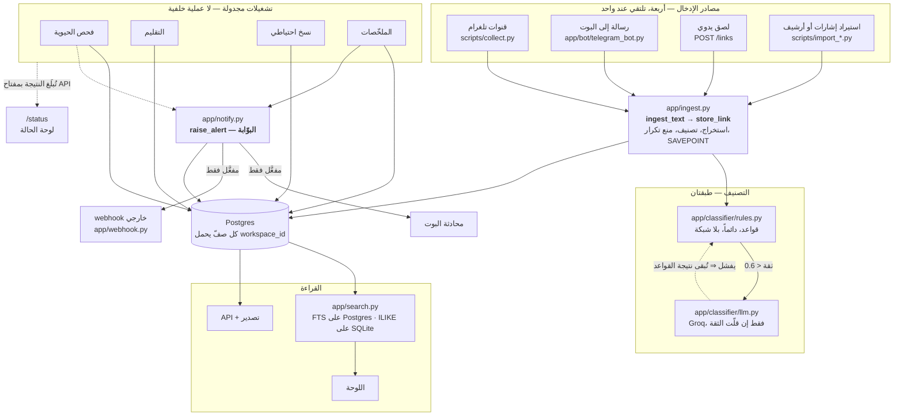

# قرارات معمارية اتُّخذت فعلاً

الفكرة ٢٣٠. **ليست قائمة قرارات نموذجية.** كل قرار هنا اتُّخذ في هذا
المستودع، وله بديل حقيقي كان مطروحاً، وسببٌ يمكن مراجعته — وبعضها اتُّخذ
**بعد** قياس ناقض التوقّع.

الشكل ثابت: القرار، البديل، لماذا، وماذا كلّف.

---

## ١. FastAPI لا Flask

**البديل:** Flask، وهو أبسط وأشيع.

**لماذا:** ثلاثة أشياء يحتاجها هذا المشروع تأتي مدمجة في الأوّل ومُلحَقة في
الثاني — التحقّق من الأنواع عبر Pydantic، وتوليد OpenAPI تلقائياً، ودعم
`async` أصيل. الأخير ليس ترفاً: فحص الحيوية يفحص مئات الروابط في تشغيلة
واحدة، والبوت غير المتزامن يشترك مع الويب في العملية نفسها.

**الكلفة:** منحنى تعلّم أعلى، وتبعية على Pydantic v2 صارمة كسرت التوافق مع
`aiogram` مرّة وتطلّبت تثبيت إصدارات.

---

## ٢. Postgres في الإنتاج وSQLite في التطوير — ومعرفة أنّهما ليسا واحداً

**البديل:** Postgres في الحالتين (عبر Docker محلياً).

**لماذا:** Docker مستبعد بقرار صريح في هذا المشروع. وSQLite بلا خادم ولا
إعداد، فيجعل الاختبارات تعمل في أيّ مكان بلا بنية تحتية.

**والقرار الحقيقي ليس هذا بل ما تلاه:** المحرّكان **يختلفان في البحث**
اختلافاً جوهرياً — بحث نصّي كامل مع ترتيب بالصلة على الأوّل، و`ILIKE` على
الثاني. فبدل التظاهر بالتكافؤ، تُشغَّل **حزمة اختبارات على Postgres حقيقي**
في CI إلى جانب SQLite. الاختلاف موثَّق، ومُختبَر، وليس مفاجأة إنتاج.

**الكلفة:** مهمّة CI إضافية، وانضباط دائم في تذكّر أنّ نجاح اختبار محلياً
لا يعني نجاحه على Postgres.

---

## ٣. تشغيلات مجدولة لا عملية خلفية

**البديل:** عامل (worker) دائم يجمع باستمرار — الشكل الطبيعي لهذه المهمّة.

**لماذا:** **لا توجد خطة عامل مجانية على Render.** ليس تفضيلاً معمارياً بل
قيد. فكل ما يحتاج دورية — الجمع، الحيوية، التقليم، النسخ الاحتياطي،
الملخّصات — صار تشغيلة مجدولة في GitHub Actions.

**الكلفة، وهي حقيقية:** الجدولة كلّها معلّقة على مزوّد واحد. تعطّله يوقف
كل شيء، وهذا موثَّق كفجوة معترف بها في `docs/19-runbook.md` §٥ لا مطموس.
وأثر ثانٍ: تشغيلة **لا تبدأ أصلاً** لا تُبلِّغ شيئاً، فغياب صفّ حديث في
لوحة الحالة يعني إمّا سلامة وإمّا توقّفاً — يُقرأ بالعمر.

---

## ٤. البوت بـwebhook لا polling

**البديل:** `polling`، وهو أبسط في الإعداد.

**لماذا:** `polling` حلقة لا تنتهي = عملية دائمة = القرار ٣ نفسه. أمّا
الـwebhook فطلب HTTP عادي يصل إلى الخدمة القائمة.

**الكلفة:** يحتاج عنواناً عامّاً بـ`https` (متاح على Render)، وسرّاً في
المسار للتحقّق، وأوّل رسالة بعد النوم تتأخّر بمقدار البرود.

---

## ٥. التصنيف بالقواعد أوّلاً، والنموذج اللغوي طبقة اختيارية

**البديل:** نموذج لغوي لكل رابط — أدقّ بوضوح.

**لماذا:** أيّ واجهة مقيسة تكسر شرط التكلفة الصفرية عند حجم كافٍ. فالقواعد
تعمل **دائماً** وبلا شبكة، ولا يُستشار النموذج إلا حين تنخفض ثقتها.

**الكلفة:** دقّة أقلّ على الروابط الغامضة. مخفَّفة بأنّ كل تصحيح بشري
يُسجَّل (الفكرة ٢٠)، وهو ما يبني مجموعة البيانات التي تحتاجها أفكار ضبط
العتبات لاحقاً — الترتيب مقصود.

---

## ٦. تشفير قابل للفكّ لجلسات تلغرام، وتجزئة لكل شيء آخر

**البديل:** تجزئة كل شيء (أسلم)، أو تخزين كل شيء كما هو (أبسط).

**لماذا:** لا يصلح أيّ منهما للحالتين. كلمة المرور لا تُستعاد أبداً فتُجزَّأ.
لكنّ Telethon يحتاج **نصّ** الجلسة ليتّصل، فالتجزئة مستحيلة — ويبقى
التشفير المتماثل. واختير Fernet لأنّه **مُوثَّق**: نصّ مبتور أو معدَّل
يرمي خطأً بدل أن يفكّ إلى قمامة صامتة.

**الكلفة، وهي بلا استرجاع:** فقدان `FIELD_ENCRYPTION_KEY` يعني فقدان تلك
الحقول نهائياً. مذكور في `docs/19-runbook.md` بلا تلطيف.

---

## ٧. التشغيلات تُبلِّغ الخدمة، لا الخدمة تقرأ GitHub

**البديل — وهو ما طلبته الفكرتان ١٨١ و١٨٣ حرفياً:** أن تقرأ الخدمة واجهة
GitHub Actions.

**لماذا عُكس الاتجاه:** ذلك يعني تخزين رمز وصول للمستودع في قاعدة بُني
نموذجها الأمني كلّه على ألّا تحمل شيئاً بهذه القوة. فبدل ذلك تُبلِّغ
التشغيلة الخدمةَ عند انتهائها، بمفتاح API **لا يستطيع لمس المستودع
إطلاقاً**. مفتاح مسرَّب أقصى ما يفعله إضافة ضجيج إلى لوحة حالة.

**الكلفة:** الالتباس في القرار ٣ — تشغيلة لا تبدأ لا تُبلِّغ.

---

## ٨. الـwebhook الخارجي بدل تكامل مع كل خدمة

**البديل:** تكامل OAuth مع Slack وDiscord وغيرهما.

**لماذا:** كلٌّ منها تطبيق OAuth ورمز طرف ثالث مخزَّن وعميل يُصان. وطلب
`https` واحد إلى عنوان يملكه المستخدم يصل إليها جميعاً عبر ميزة موجودة
فيها أصلاً.

**الكلفة، وهي أمنية:** هذا **الموضع الوحيد** الذي تطلب فيه الخدمة عنواناً
اختاره مستخدم. ولهذا: `https` فقط، وعناوين عامّة فقط، ولا اتّباع لأيّ
تحويل، ولا قراءة لجسم الاستجابة. وثمّة نافذة `TOCTOU` **لم تُغلَق** وسببُ
قبولها مكتوب في `app/webhook.py` لا مُلمَّح إليه.

---

## ٩. تفويض الأحداث بدل مستمع لكل عنصر

**البديل:** `addEventListener` على كل زرّ بعد كل إعادة رسم.

**لماذا:** اللوحة تعيد رسم قوائمها باستمرار، ومستمعٌ مربوط بعنصر يختفي
بعنصره. فمستمع واحد على المستند يقرأ `data-action` يبقى صحيحاً مهما
أُعيد الرسم. وهذا شرط لازم لـ`script-src 'self'` أيضاً: لا `onclick=` في
أيّ وسم.

**الكلفة — ودُفعت فعلاً:** المُوزِّع كان يستدعي `preventDefault()` على كل
نقرة، و`preventDefault()` على نقرة **مربّع اختيار** تُلغي التأشير. فمرشّحان
في اللوحة توقّفا تماماً منذ دمج المرحلة ٨د، بلا خطأ في الطرفية وبكل
اختبارات بايثون خضراء. كشفه تشغيل الواجهة في متصفّح حقيقي، لا الاختبارات.

---

## ١٠. قياسٌ نقض التوقّع: الترقيم بالإزاحة يبقى

**البديل:** ترقيم بمؤشّر (cursor)، وهو الأصحّ نظرياً بلا خلاف.

**القياس على ٥٠ ألف صفّ في Postgres حقيقي:** الصفحة الأولى ٠٫١٣ ملّي
ثانية، والصفحة الأخيرة ١٧٫٨. الفارق **١٣٧ ضعفاً** — حقيقي تماماً، وغير
محسوس لإنسان.

**القرار:** لا يُغيَّر شكل كل نقطة قائمة في الواجهة مقابل ١٧ ملّي ثانية.
مسجَّل في `docs/06-rejected.md` **كرفض بقياس لا بإهمال**، وقابل للمراجعة
إن تغيّر الرقم.

---

## تدفّق البيانات الفعلي (الفكرة ٢٣١)

الرسم أدناه يصف **ما يحدث فعلاً** في هذا المستودع اليوم، لا معمارية
مقترحة. كل صندوق ملفٌّ موجود:

**ثلاثة أشياء يقولها هذا الرسم ولا يقولها وصف نصّي:**

1. **مسارات الإدخال الأربعة تلتقي عند `ingest_text` واحد.** لا تصنيف ولا
   تخزين يتفرّع حسب المصدر — وهو مبدأ معماري ثابت لا صدفة.
2. **كل التنبيهات تمرّ ببوّابة واحدة.** البوت والـwebhook كلاهما **بعدها**.
   مسارٌ يلتفّ حولها يجعل «كل تنبيه قابل للتعطيل» كذبة.
3. **السهم إلى لوحة الحالة يخرج من التشغيلات لا يدخل إليها** — وهو القرار ٧
   مرسوماً.
