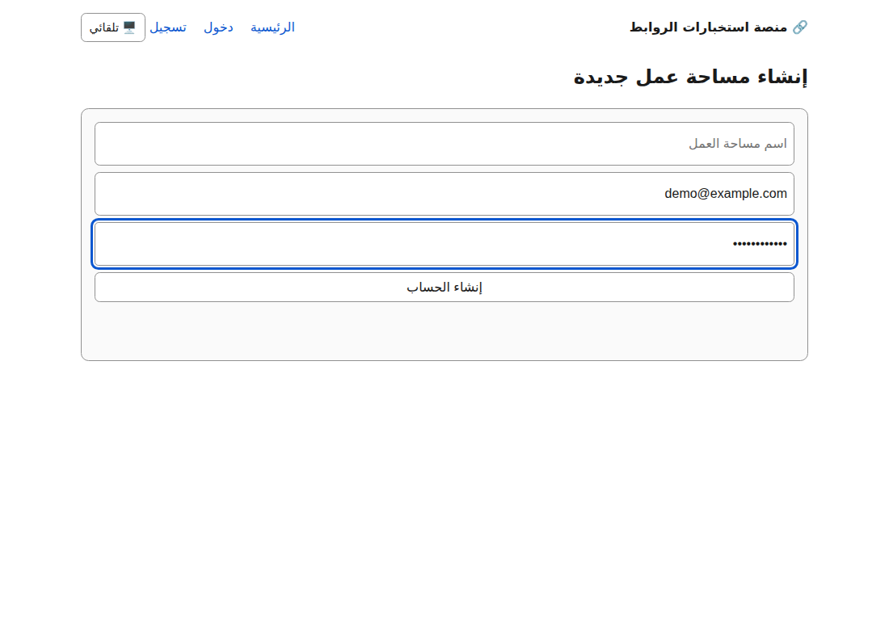
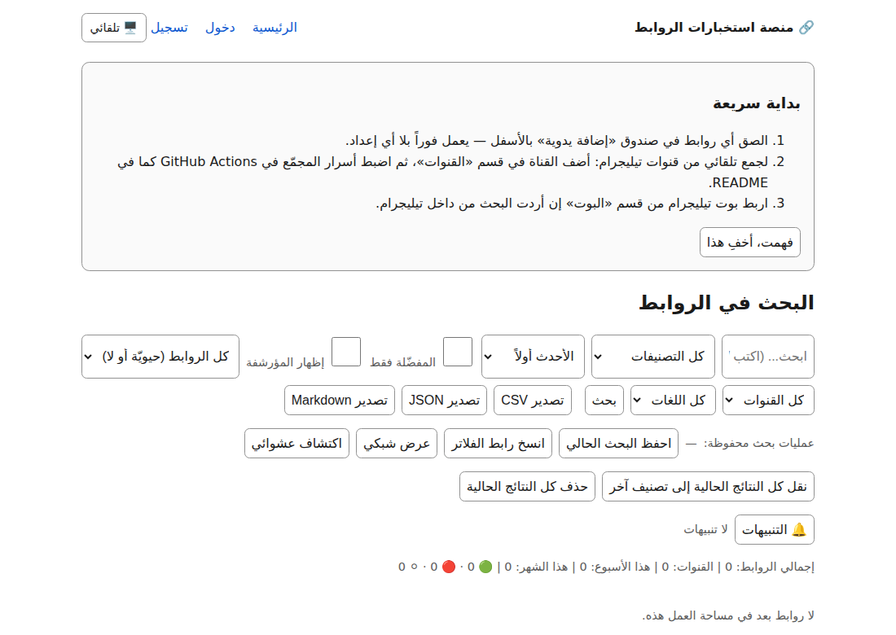
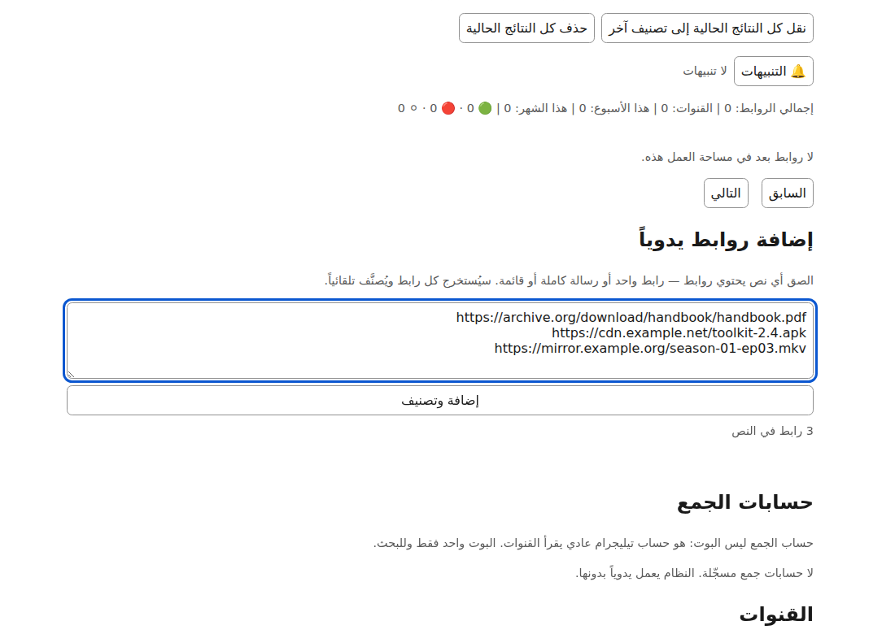
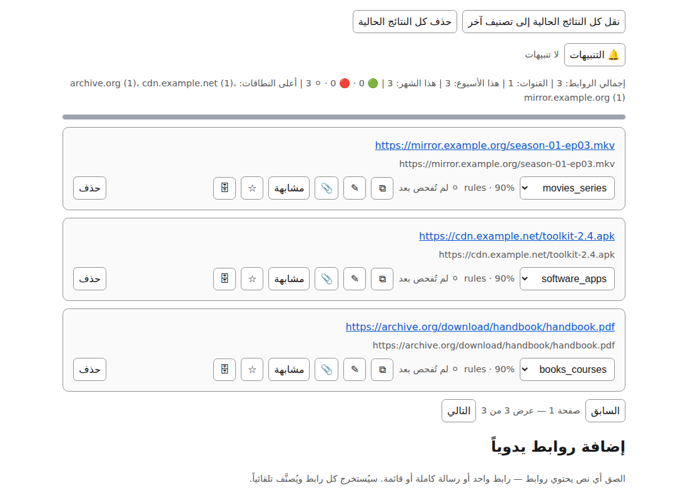
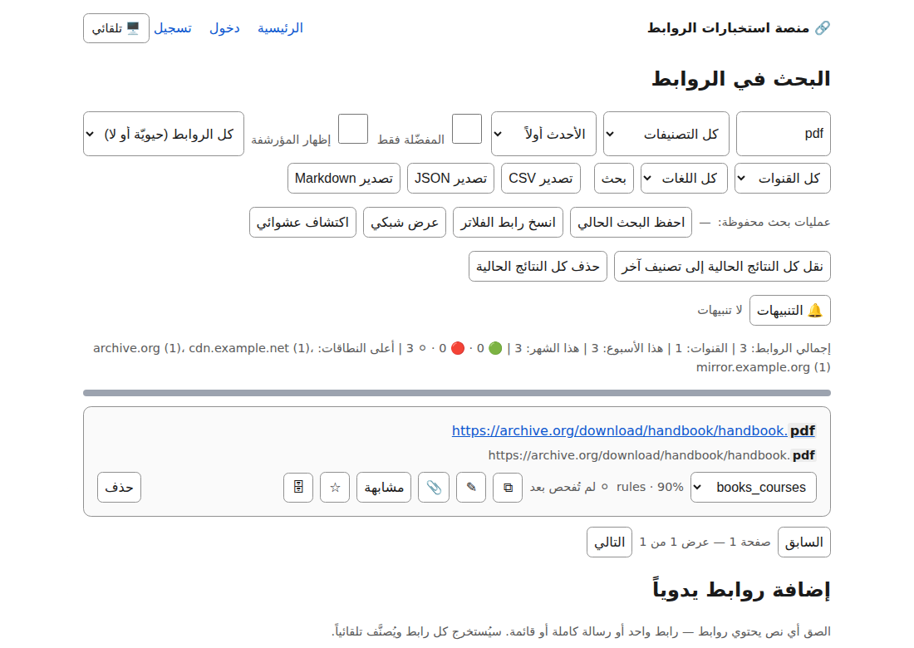

# جولة مصوّرة — من التسجيل إلى أوّل بحث

الفكرة ٢٣٢ طلبت **تسجيل شاشة** قصيراً. المُنجَز لقطات حقيقية لا فيديو،
والسبب عمليّ لا تهرّب:

> **GitHub لا يعرض ملفّ فيديو مخزَّناً في المستودع داخل صفحة Markdown** —
> يحوّله إلى رابط تنزيل. أمّا الصور فتُعرَض في مكانها. ولأنّ الغرض المعلن
> هو أن يرى المقيّم التدفّق **دون تشغيل شيء**، فاللقطات تخدمه واللقطات
> فقط.

**كل لقطة أدناه مأخوذة آلياً من التطبيق وهو يعمل فعلاً**
(`playwright` على Chromium حقيقي)، لا رسماً ولا نموذجاً أوّلياً. والبيانات
فيها ملفَّقة لكنّ سلوك المنصّة عليها حقيقيّ تماماً.

---

## ١. التسجيل

بريد وكلمة مرور واسم مساحة عمل. حقل **رمز الدعوة** يظهر لأنّ
`INVITE_CODE` مضبوط؛ بدونه يكون التسجيل مفتوحاً لكلّ من يصل إلى الرابط
العام — ولهذا يُنصَح بضبطه في `docs/20-quickstart.md` §٢.

---

## ٢. اللوحة فارغة

لا توجد بيانات تجريبية ولا محتوى مزروع. مساحة عمل جديدة فارغة فعلاً،
وحالتها الفارغة تشرح ماذا تفعل بعدها.

---

## ٣. لصق روابط

الصندوق يقبل **نصّاً** لا روابط مرتّبة: الصق رسالة كاملة أو قائمة، ويُستخرَج
منها كل رابط. هذه واحدة من أربعة مسارات إدخال — والأربعة تمرّ بالدالّة
نفسها (`app/ingest.py`)، فلا يتفرّع التصنيف ولا التخزين حسب المصدر.

---

## ٤. مصنَّفة ومخزَّنة

ثلاثة روابط، ثلاثة تصنيفات، **بلا أيّ اتصال شبكي**:

| الرابط | التصنيف | لماذا |
|---|---|---|
| `…/season-01-ep03.mkv` | `movies_series` | امتداد `mkv` |
| `…/toolkit-2.4.apk` | `software_apps` | امتداد `apk` |
| `…/handbook.pdf` | `books_courses` | امتداد `pdf` |

ولاحظ ما يُعرَض مع كل رابط: **`rules · 90%`** — أي أنّ طبقة القواعد هي التي
صنّفته وبأيّ ثقة. الطبقة اللغوية الاختيارية لم تُستشَر أصلاً لأنّ الثقة
تجاوزت العتبة. و**«لم تُفحص بعد»** حالة حيوية صادقة، مختلفة عمداً عن
«ميت»: لا فحص جرى بعدُ، وادّعاء أيّ شيء آخر اختلاق.

الشريط العلوي يلخّص: ٣ روابط، ٣ قنوات، وأعلى النطاقات.

---

## ٥. البحث

الكتابة في صندوق البحث **لا تُشغّل بحثاً** بل تعرض **عدّاداً حيّاً**
(«١ نتيجة») بينما تبقى النتائج المعروضة كما هي. البحث الفعليّ يقع عند
الضغط على «بحث».

هذا مقصود لا سهو: عدّاد الاستطلاع طلبٌ بصفحة واحدة، أرخص كثيراً من رسم
نتائج كاملة بعد كل حرف. فتعرف **كم** ستجد قبل أن تدفع ثمن جلبها.

---

## ما لا تُظهره هذه اللقطات

بصراحة، حتى لا تُقرأ كأنّها كلّ شيء:

- **الجمع التلقائي من قنوات تلغرام** — يحتاج حساب جمع وتشغيلة مجدولة، ولا
  يظهر أثره في جلسة متصفّح واحدة.
- **البحث كما هو في الإنتاج** — هذه اللقطات على SQLite محلياً، أي `ILIKE`.
  على Postgres يعمل بحث نصّي كامل مع ترتيب بالصلة، والفارق موثَّق في
  `docs/24-decisions.md` §٢.
- **التنبيهات والحيوية والوضع الليلي** — كلّها مشحونة، ولا تدخل في «أوّل
  دقيقتين».

الخطوات نصّاً في `docs/20-quickstart.md`.
